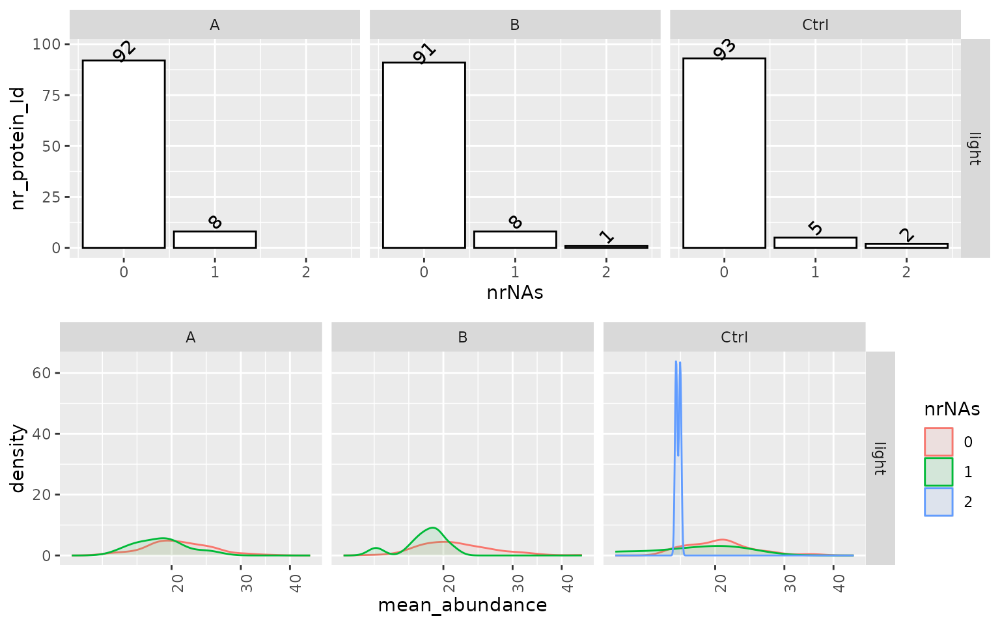
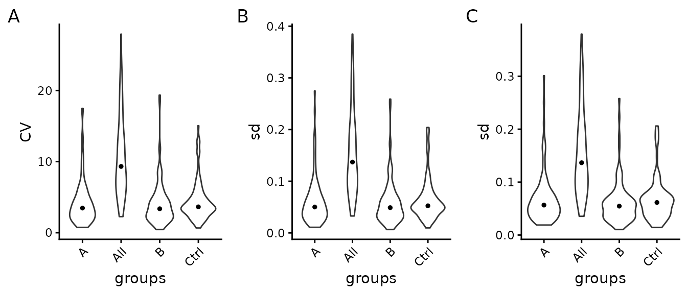
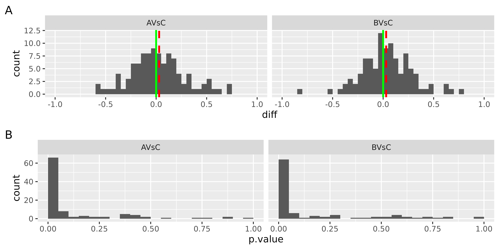
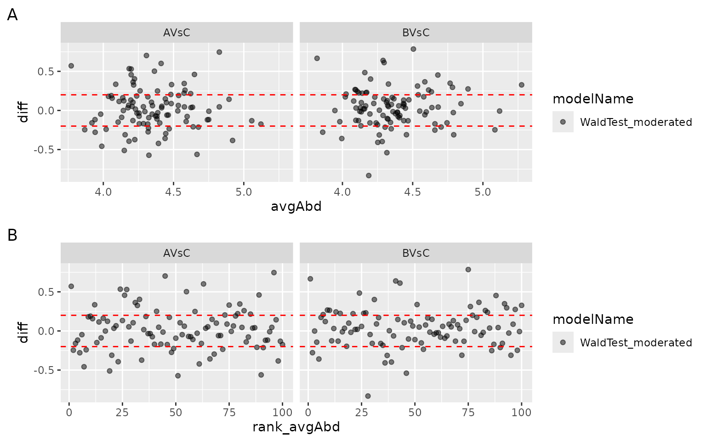

# Differential Expression Analysis Quality Control.

## Missing Value analysis

The analysis of missing values can be an essential indicator of
potential problems and biases in the data. We, therefore, visualize the
structure of missing values (missing protein abundance estimate per
protein) using various plots. Figure @ref(fig:missingProtein) left panel
shows the number of proteins (y) axis with $0 - N$ missing values
(x-axis) in each group. Ideally, a protein should be observed in all
samples within a group (zero missing values). The density plot on the
right panel (Figure @ref(fig:missingProtein)) shows the distribution of
the mean protein intensity within a group, given $0 - N$ missing values.
Usually, proteins with zero missing values have a higher average
abundance than those with one or more missing values because low
abundant proteins might not be detected in some samples. However, if
these distributions strongly overlap, this points to a different source
of missingness, e.g., large sample heterogeneity or technical problems.

(ref:missingProtein) Left panel - number of proteins with $n$ missing
values (nrNA), Right panel - distribution of average intensity within
group, of proteins with 1 to N missing values.

(ref:missingProtein)

## Variance analysis of the data

The left panel A of Figure @ref(fig:SDViolin), shows the coefficients of
variations (CV) for all proteins computed on not normalized data.
Ideally, the within-group CV should be smaller than the CV of all
samples. Panel B of Figure @ref(fig:SDViolin) shows the distribution of
the standard deviation for all proteins of log2 transformed data, while
the right panel C of Figure @ref(fig:SDViolin) shows it for normalized
data. We expect that within-group variance is decreased by data
normalization compared with the overall variance (all). However, if
normalization increases within group variance compared to overall
variance, this indicates an incompatibility of the normalization method
and the data.

(ref:SDViolin) Left panel - Distribution of coefficient of variation
(CV) within groups and in entire experiment (all), Center panel -
Distribution of standard deviations (sd) of $\log_{2}$ transformed data.
Right panel - Distribution of protein standard deviation (sd), after
data normalization within groups and in entire experiment. The black dot
indicates the median CV.

(ref:SDViolin)

The Table @ref(tab:CVtable) shows the median CV of all groups and across
all samples (all).

| what    |    A |    B | Ctrl |  All |
|:--------|-----:|-----:|-----:|-----:|
| CV      | 3.47 | 3.37 | 3.64 | 9.32 |
| sd_log2 | 0.05 | 0.05 | 0.05 | 0.14 |
| sd      | 0.06 | 0.05 | 0.06 | 0.14 |

Median (prob 0.5) of coefficient of variation (CV) and standard
deviation (sd)

## Differential Expression Analysis

Typically most of the datasets’ proteins are not differentially
expressed, i.e., the differences between the two groups should be close
to zero. Figure @ref(fig:densityOFFoldChanges) shows the distribution of
differences between the groups for all the proteins in the dataset.
Ideally, the median of this distribution (red line) should equal zero
(green line). If the median and mode of the difference distribution are
non zero, this should be considered when interpreting the differential
expression analysis results.

The bottom panel in Figure @ref(fig:densityOFFoldChanges) shows the
distribution of the p-values for all the proteins. If the null
hypothesis is true, the distribution of the p-values will be uniform. If
a subset of proteins is differentially expressed this will result in a
higher frequency of small p-values. If there is a higher frequency of
large p-values (close to 1) this indicates that the linear model fails
to describe the variance of the data; the reasons might be: outliers, a
source of variability not included in the model.

(ref:densityOFFoldChanges) Top : distribution of the differences among
groups for all the proteins in the dataset. red dotted line - median
fold change, green line - expected value of the median fold change.
Bottom - histogram of p-values for all the proteins in the dataset.
X-axis - p-values, Y-axis - frequency of p-values.

(ref:densityOFFoldChanges)

To identify abundant proteins with large differences or if only low
abundant proteins show large fold changes the ma-plot Figure
@ref(fig:MAPlot) Panel A can be used. The ma-plot shows the differences
between measurements taken in two groups (y-axis) as a function of the
average protein abundance (x-axis). More importantly, the observed fold
change should not depend on the protein abundance. Figure
@ref(fig:MAPlot) panel B plots the difference of each protein against
the rank of the average protein abundance.

(ref:MAPlot) MA plot: x - axis: average protein abundance (Panel A) or
rank of average protein abundance (Panel B), y - axis: difference
between the groups.

(ref:MAPlot)
