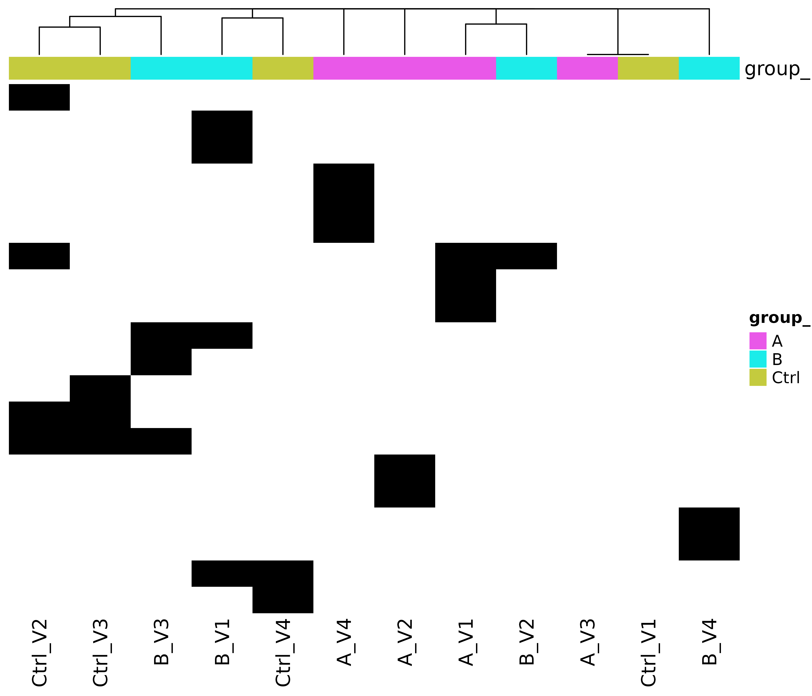
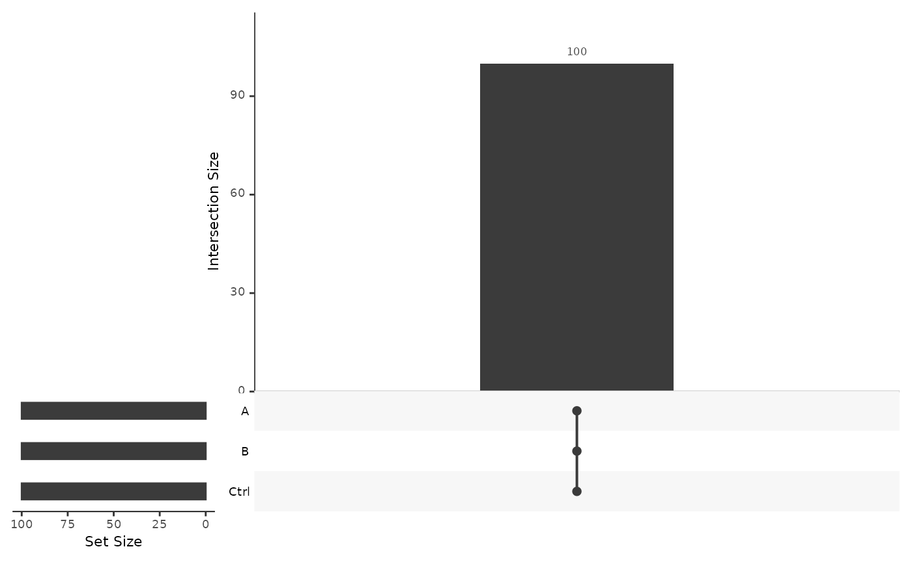
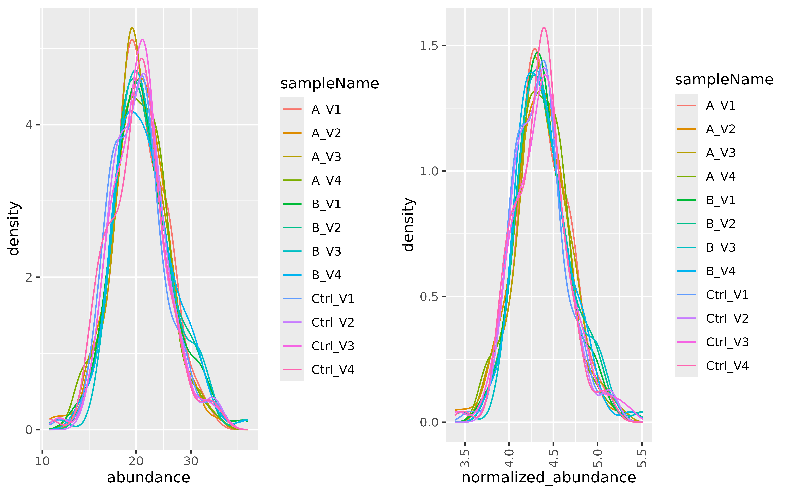
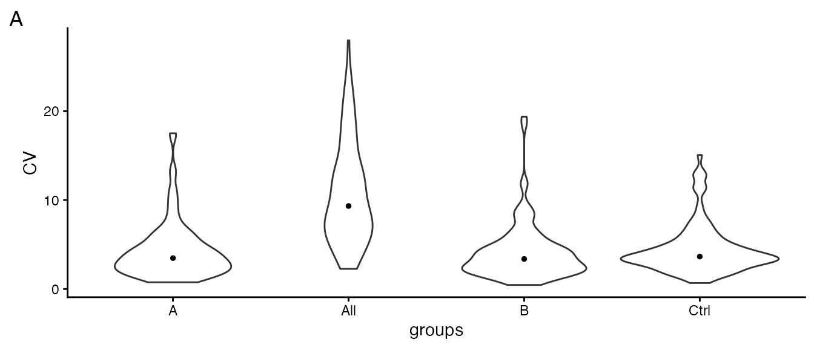
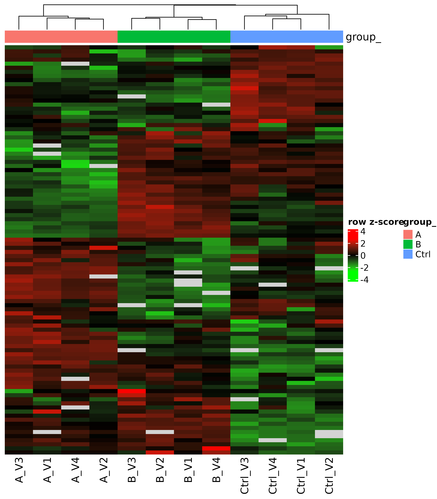
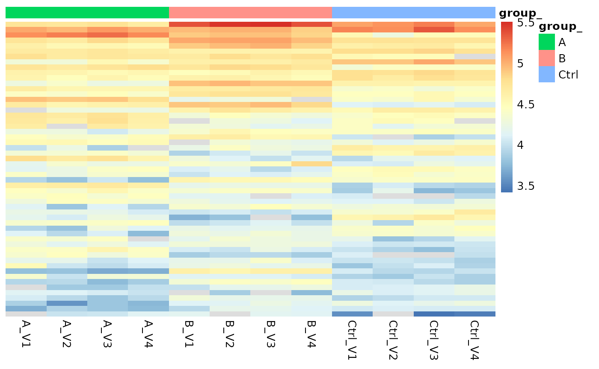
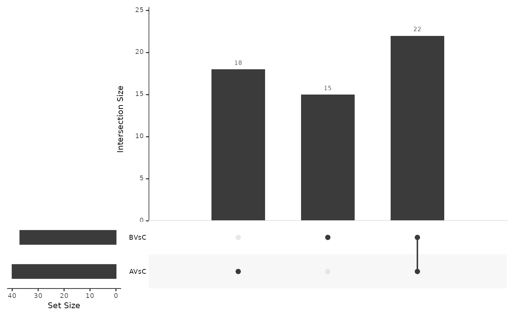

# Differential Expression Analysis.

## B-fabric related information

This report is stored in the LIMS system
[*bfabric*](https://fgcz-bfabric.uzh.ch) (Panse, Trachsel, and Türker
2022) in **project**: , **order**: , with the workunit name: .

The protein identification and quantification were performed using:
DIANN. The input file can be downloaded from here:
<https://fgcz-bfabric.uzh.ch/bfabric/>. The set of parameters used to
run the quantification software can be retrieved from the b-fabric
workunit to which this file belongs.

## Introduction

The differential expression analysis verifies if the **difference**
between normalized empirical protein abundances measured in two groups
is significantly non-zero. To make the test as sensitive and specific as
possible, the methods used to measure (Taverna and Gaspari 2021) and
estimate protein abundances (Grossmann et al. 2010) are optimized to
minimize the biochemical and technical variance. In addition, these
empirical abundances $A$ are further $log_{2}$ transformed and scaled to
make them compatible with the statistical test procedure (Välikangas,
Suomi, and Elo 2018). Therefore, we obtain a scale free $\log_{2}$
transformed normalized protein abundances $\log_{2}(A)$ for a sample.

For unpaired experiments the difference $\Delta$ between group $a$ and
$b$, for a specific protein is estimated by:

$$\Delta = \frac{1}{n}\sum\limits_{i = 1}^{n}\log_{2}\left( A_{i}^{a} \right) - \frac{1}{m}\sum\limits_{j = 1}^{m}\log_{2}\left( A_{j}^{b} \right)$$

where $A_{i}^{a}$ - is the normalized protein abundance of sample $i$ in
the group $a$ of $n$ samples, while $A_{j}^{b}$ is the protein abundance
of sample $j$ in group $b$ of $m$ samples.

For paired experiments, the difference is estimated by:

$$\Delta = \frac{1}{n}\sum\limits_{i = 1}^{n}\log_{2}\left( A_{i}^{a} \right) - \log_{2}\left( A_{i}^{b} \right)$$

where $n$ is the number of subjects, each treated with $a$ and $b$.

Of note, when comparing two samples $a$ and $b$ the difference of
logarithms equals the logarithm of the ratio (exponent rule):

$$\log\left( A^{a} \right) - \log\left( A^{b} \right) = \log\left( \frac{A^{a}}{A^{b}} \right)$$

It is called the $\log$-ratio or $\log$ fold-change (logFC).

The estimated differences $\Delta$ have an associated error $\epsilon$.
Therefore, the differential expression analysis must test if the
difference is significantly nonzero.

We run a set of functions implemented in the R package *\[prolfqua\]*
(Wolski et al. 2023) to filter and normalize the data, generate
visualizations, and to compute differential expression analysis. To
further improve the power of the differential expression test the
protein variances are moderated (Smyth 2004), i.e. the individual
protein variances are updated using a variance prior estimated from all
the proteins in the experiment.

## Results

Table @ref(tab:samples) shows the number of samples assigned to each
group while Table @ref(tab:annotation) shows the names of the files
assigned to the group.

| group\_ | \# samples |
|:--------|-----------:|
| A       |          4 |
| B       |          4 |
| Ctrl    |          4 |

Nr of samples assigned to each group.

| sample  | sampleName | group\_ | nr_1 | nr_2 |
|:--------|:-----------|:--------|-----:|-----:|
| A_V1    | A_V1       | A       |   97 |   69 |
| A_V2    | A_V2       | A       |   98 |   73 |
| A_V3    | A_V3       | A       |  100 |   68 |
| A_V4    | A_V4       | A       |   97 |   72 |
| B_V1    | B_V1       | B       |   96 |   74 |
| B_V2    | B_V2       | B       |   99 |   72 |
| B_V3    | B_V3       | B       |   97 |   75 |
| B_V4    | B_V4       | B       |   98 |   71 |
| Ctrl_V1 | Ctrl_V1    | Ctrl    |  100 |   72 |
| Ctrl_V2 | Ctrl_V2    | Ctrl    |   96 |   69 |
| Ctrl_V3 | Ctrl_V3    | Ctrl    |   97 |   72 |
| Ctrl_V4 | Ctrl_V4    | Ctrl    |   98 |   72 |

LC-MS samples annotation table. The content of the sampleName column is
used as a short form to plot labels. The group to which a sample is
assigned is shown in the column group.

### Peptide and Protein identification

The protein matrix is filtered using the following threshold:

- Minimum number of peptides / protein: 1.

The overall number of proteins including contaminant proteins in this
experiment is: 100. The percentage of contaminant proteins is:0 %. The
percentage of false positive identifications (Decoy sequences) is 0 %.

We keep the contaminant proteins because, for some experiments, these
contaminants are relevant. However, they can be recognized since their
identifiers start with **zz** or **CON**. We also keep the decoy
sequences because they allow us to re-estimate the proportion of falsely
identified proteins in the list of differentially expressed proteins,
which might differ from that of entire dataset. The identifiers of the
decoy proteins start with **REV** or **rev**.

Figure @ref(fig:nrPerSample) shows the number of quantified proteins
with one or more peptides per sample.

Number of identified proteins across samples.

Figure @ref(fig:nrPerSample2) shows the number of quantified proteins
with two or more peptides per sample.

Number of identified proteins across samples.

### Missing Value Analysis

The absence of a protein measurement in a sample might be biologically
relevant or might point to technical problems. Significant differences
in the set of proteins observed in the samples within a group typically
indicate either technical problems or excessive biological variability.
If one sample out of ten has a different set of proteins, it is likely
an outlier and can be removed from the analysis. If the differences
between the groups are significant but within the groups are small, this
might systematically bias the difference estimates, i.e., produce
false-positive or false-negative test results.

A dichotomous view of the data can be constructed by transforming
protein abundance estimates into present/absent calls (Figure
@ref(fig:naHeat) ). The heatmap shows only proteins with at least one
missing value. There are 20 proteins with at least one missing value in
the data, which is (20 %).

We expect that samples in the same group are more similar and cluster
together, i.e., they are in the same branch of the dendrogram.

(ref:naHeat) Protein abundance heatmap (rows indicate proteins, columns
indicate samples) showing missing protein abundance estimates across the
data set. Rows and columns are grouped based on the Minkowski distance
using hierarchical clustering. White: Protein is observed, black:
Protein is not observed.

(ref:naHeat)

Using Figure @ref(fig:vennProteins) we examine if we see the same
proteins in each group. We say a protein is unobserved in the group if
it is absent in all samples and is present otherwise. A significant
overlap among groups allows more precise estimation of the protein
abundance differences between the groups.

(ref:vennProteins) Venn diagram showing the number of proteins present
in each group and in all possible intersections among groups.

(ref:vennProteins)

### Protein Abundance Analysis

The density plot (Figure @ref(fig:normalized) left panel) displays the
protein abundance distribution for all data set samples. Major
differences between samples could indicate that the individual protein
abundance values are affected by technical biases. These biases might
need to be corrected to separate them from biological effects. The right
panel of Figure @ref(fig:normalized) shows the distribution of the
transformed and scaled normalized empirical protein abundances.
Normalization is applied to remove systematic differences in protein
abundances due to different sample concentrations or amounts of sample
loaded on a column. However, in the presence of a large proportion of
missing data, normalization potentially amplifies systematic errors.

To do this the z-score of the $\log_{2}$ transformed protein abundances
are computed. Because we need to estimate the protein differences on the
original scale, we have to multiply the $z$-score by the average
standard deviation of all the $N$ samples in the experiment. After
normalization all samples have an equal mean and variance and a similar
distribution.

(ref:normalized) Kernel density function showing the distribution of
protein abundances in all samples. Left panel: Empirical protein
abundance of all samples in the dataset. Right panel: Normalized
empirical protein abundances of all samples in the dataset.

(ref:normalized)

The median coefficient of variation (CV) of a group of samples or all
samples in the dataset, can be used to compare the experiment with other
experiments (Piehowski et al. 2013). For example, the median CV for
high-performance liquid chromatography experiments ranges from 2% to 35%
depending on the biological samples studied, the chromatography method
used, label-free or labelled quantification (Taverna and Gaspari 2021).

Figure @ref(fig:SDViolin) shows the coefficients of variation (CV) for
all proteins computed on non-normalized data. Ideally the within group
CV should be smaller than the CV of all samples.

(ref:SDViolin) Distribution of coefficient of variation (CV) within each
group and in the entire experiment (all).

(ref:SDViolin)

Table @ref(tab:CVtable) shows the median CV of all groups and across all
samples (all).

| what |    A |    B | Ctrl |  All |
|:-----|-----:|-----:|-----:|-----:|
| CV   | 3.47 | 3.37 | 3.64 | 9.32 |

Median of coefficient of variation (CV).

The protein abundance heatmap (Figure @ref(fig:heatmap)) groups the
protein and samples using unsupervised hierarchical clustering.
Distances between proteins and samples are computed using normalized
protein abundances. Proteins with a large proportion of missing
observations are not shown in this heatmap, because for these proteins
no distance can be computed. Proteins and samples showing similar
abundances are grouped and shown in adjacent rows and columns
respectively.

(ref:heatmap) Protein abundance heatmap (rows indicate proteins, columns
indicate samples) showing the row scaled $\log_{2}$ transformed protein
abundance value. Co-clustering (hierarchical complete linkage, euclidean
distance) of samples and proteins was used.

(ref:heatmap)

We use principal component analysis (PCA) to transform the
high-dimensional space defined by all proteins into a two-dimensional
one containing most of the information. Plot @ref(fig:pca) shows the
location of the samples according to the first and second principal
component, which explain most of the variance in the data. Samples close
in the PCA plot are more similar than those farther apart.

(ref:pca) Plot of first and second principal component (PC1 and PC2) of
principal component analysis (PCA). Normalized abundances were used as
input.

(ref:pca)

## Differential Expression Analysis

The method used to test for differential expression consists of several
steps: First a linear model that explains the observed protein
abundances using the grouping of the samples is fitted using the R
function *lm* to each protein:

normalized_abundance ~ group\_.

Secondly, the difference between the groups is computed (Table
@ref(tab:contrtable)).

| name | contrast             |
|:-----|:---------------------|
| AVsC | group_A - group_Ctrl |
| BVsC | group_B - group_Ctrl |

Name of difference (Contrast), and formula used to compute it.

and a null hypothesis significance test (NHST) is conducted, where the
null hypothesis is that the protein is not differentially expressed
(Faraway 2004).

If there are no abundances measured in one of the groups for some
proteins, we assume the observations are missing because the protein
abundance is below the detection limit. Therefore, we estimate the
detection limit using the mean of the $1\%$ smallest group averages.
Furthermore, to make it explicit for which proteins we did impute the
unobserved group mean, we label them with `Imputed_Mean` (see table in
Figures @ref(fig:tableAllProt) column `modelName`) and visualize them
with gray dots in Figure @ref(fig:volcanoplot). Finally, those proteins
with a sufficiently large number of observations are labeled with
`Linear_Model_Moderated`.

Next, to increase the power of the analysis variance shrinkage is
performed (Smyth 2004). Finally, the false discovery rate (FDR) using
the Benjamini-Hochberg procedure is computed (Benjamini and Hochberg
1995). The FDR is the expected proportion of false discoveries in a list
of proteins, and can be used to select candidates for follow up
experiments. FDR thresholds commonly used are 5, 10 or 25%. By filtering
the proteins using an FDR threshold of 10 % we can expect this
proportion of false positives in the list and 90 % truly differentially
expressed proteins. Because we do not know which of them are true
positives follow up experiments are necessary.

The table (Figure @ref(fig:tableAllProt)) summarizes the differential
expression analysis results by providing the following information:

- protein_Id - unique protein identifier
- description - information about the protein provided in the FASTA
  database
- contrast - name of the comparison
- modelName - name of the method to estimate differences : Imputed_mean
  or Linear_Model_Moderated
- FDR - false discovery rate
- diff - difference between groups.

The volcano plot @ref(fig:volcanoplot) helps to identify proteins with
large differences among groups and a low FDR. The significance dimension
is a $- \log_{10}$ transformed FDR, i.e., small values of FDR become
large after transformation. Promising candidate proteins are found in
the upper right and left sector of the plot.

Differential expression analysis results of all proteins.

(ref:volcanoplot) Volcano plot showing $- \log_{10}$ transformed FDR as
function of the difference between groups. The red line indicates the
$- log_{10}(FDR)$ of FDR = 0.1, while the green lines represent the
difference of minus and plus 0.2. With orange dots differences and FDRs
estimated using missing value imputation are shown.

(ref:volcanoplot)

### Differentially Expressed Proteins

Here we use the FDR threshold of 0.1 and a difference threshold of 0.2
to select differentially expressed proteins. Table
@ref(tab:nrsignificant) summarizes the number of significant calls.

| contrast |   n | Significant | Not Significant |
|:---------|----:|------------:|----------------:|
| AVsC     | 100 |          40 |              60 |
| BVsC     | 100 |          37 |              63 |

Number of not significant and significant proteins.

The table shown in Figure @ref(fig:SigPrey) lists all the significant
proteins.

(ref:SigPrey) Significant proteins obtained by applying the difference
and FDR thresholds.

(ref:SigPrey)

Furthermore, Figure @ref(fig:sigroteins) shows a heatmap of log2
transformed protein abundances of all significant calls.

(ref:sigroteins) Heatmap showing the $\log_{2}$ transformed protein
abundances for proteins which pass the FDR and difference thresholds.

(ref:sigroteins)

(ref:vennDiagramSig) Venn diagram showing the number of significant
proteins for each contrast and their intersections.

(ref:vennDiagramSig)

## Additional Analysis

The zip file contains an Excel file **DE_Groups_vs_Controls.xlsx**. All
the figures can be recreated using the data in the excel file. The Excel
file contains the following spreadsheets:

- **annotation** - the annotation of the samples in the experiment
- **raw_abundances** table with empirical protein abundances.
- **normalized_abundances** table with normalized protein abundances.
- **raw_abundances_matrix** A table where each column represents a
  sample and each row represents a protein and the cells store the
  empirical protein abundances.
- **normalized_abundances_matrix** A table where each column represents
  a sample and each row represents a protein and the cells store the
  empirical protein abundances.
- **diff_exp_analysis** A table with the results of the differential
  expression analysis. For each protein there is a row containing the
  estimated difference between the groups, the false discovery rate FDR,
  the 95% confidence interval, the posterior degrees of freedom.
- **missing_information** - spreadsheet containing information if a
  protein is present (1) or absent in a group (0).
- **protein_variances** - spreadsheet which for each protein shows the
  variance (var) or standard deviation (sd) within a group, the number
  of samples (n) and the number of observations (not_na) as well as the
  group average intensity (mean).

The data can be used to perform functional enrichment analysis (Monti et
al. 2019). To compare the obtained results with known protein
interactions we recommend the [string-db.org](https://string-db.org/)
(Szklarczyk et al. 2017), which is a curated database of protein-protein
interaction networks for a large variety of organisms. To simplify the
data upload to string-db we include text files containing the uniprot
ids:

- `ORA_background.txt` all proteins.
- `ORA_<contrast_name>.txt` proteins accepted with the FDR and
  difference threshold.

Other web applications allowing to run over representation analysis
(ORA) (Monti et al. 2019) are:

- [DAVID Bioinformatics Resource](https://david.ncifcrf.gov/home.jsp)
- [WEB-based GEne SeT AnaLysis Toolkit](http://www.webgestalt.org) (Wang
  et al. 2017)

Furthermore, protein IDs sorted by t-statistic can then be subjected to
gene set enrichment analysis (GSEA) (Subramanian et al. 2005). To
simplify running GSEA, we provide the file:

- `GSEA_<contrast_name>.rnk`

This file can be used with the webgestalt web application or used with
the GSEA application from [gsea-msigdb](https://www.gsea-msigdb.org/)

For questions and improvement suggestions, with respect to this report,
please contact <protinf@fgcz.uzh.ch>.

## Session Information

**R version 4.6.0 (2026-04-24)**

**Platform:** x86_64-pc-linux-gnu

**locale:** *LC_CTYPE=C.UTF-8*, *LC_NUMERIC=C*, *LC_TIME=C.UTF-8*,
*LC_COLLATE=C.UTF-8*, *LC_MONETARY=C.UTF-8*, *LC_MESSAGES=C.UTF-8*,
*LC_PAPER=C.UTF-8*, *LC_NAME=C*, *LC_ADDRESS=C*, *LC_TELEPHONE=C*,
*LC_MEASUREMENT=C.UTF-8* and *LC_IDENTIFICATION=C*

**attached base packages:** *stats*, *graphics*, *grDevices*, *utils*,
*datasets*, *methods* and *base*

**other attached packages:** dplyr(v.1.2.1)

**loaded via a namespace (and not attached):** *RColorBrewer(v.1.1-3)*,
*jsonlite(v.2.0.0)*, *shape(v.1.4.6.1)*, *magrittr(v.2.0.5)*,
*jomo(v.2.7-6)*, *farver(v.2.1.2)*, *logistf(v.1.26.1)*,
*nloptr(v.2.2.1)*, *rmarkdown(v.2.31)*, *fs(v.2.1.0)*, *ragg(v.1.5.2)*,
*vctrs(v.0.7.3)*, *minqa(v.1.2.8)*, *progress(v.1.2.3)*,
*htmltools(v.0.5.9)*, *S4Arrays(v.1.11.1)*, *forcats(v.1.0.1)*,
*broom(v.1.0.12)*, *cellranger(v.1.1.0)*, *SparseArray(v.1.11.13)*,
*mitml(v.0.4-5)*, *sass(v.0.4.10)*, *bslib(v.0.10.0)*,
*htmlwidgets(v.1.6.4)*, *desc(v.1.4.3)*, *plyr(v.1.8.9)*,
*plotly(v.4.12.0)*, *cachem(v.1.1.0)*, *mime(v.0.13)*,
*lifecycle(v.1.0.5)*, *iterators(v.1.0.14)*, *pkgconfig(v.2.0.3)*,
*Matrix(v.1.7-5)*, *R6(v.2.6.1)*, *fastmap(v.1.2.0)*, *shiny(v.1.13.0)*,
*rbibutils(v.2.4.1)*, *MatrixGenerics(v.1.23.0)*, *digest(v.0.6.39)*,
*dtplyr(v.1.3.3)*, *lobstr(v.1.2.1)*, *S4Vectors(v.0.49.3)*,
*textshaping(v.1.0.5)*, *crosstalk(v.1.2.2)*, *GenomicRanges(v.1.63.2)*,
*labeling(v.0.4.3)*, *httr(v.1.4.8)*, *abind(v.1.4-8)*, *mgcv(v.1.9-4)*,
*compiler(v.4.6.0)*, *bit64(v.4.8.0)*, *withr(v.3.0.2)*,
*pander(v.0.6.6)*, *S7(v.0.2.2)*, *backports(v.1.5.1)*,
*logger(v.0.4.1)*, *UpSetR(v.1.4.0)*, *pan(v.1.9)*, *MASS(v.7.3-65)*,
*DelayedArray(v.0.37.1)*, *optparse(v.1.8.2)*, *tools(v.4.6.0)*,
*otel(v.0.2.0)*, *httpuv(v.1.6.17)*, *nnet(v.7.3-20)*, *glue(v.1.8.1)*,
*promises(v.1.5.0)*, *nlme(v.3.1-169)*, *grid(v.4.6.0)*,
*generics(v.0.1.4)*, *operator.tools(v.1.6.3.1)*, *gtable(v.0.3.6)*,
*tzdb(v.0.5.0)*, *formula.tools(v.1.7.1)*, *preprocessCore(v.1.73.0)*,
*tidyr(v.1.3.2)*, *data.table(v.1.18.2.1)*, *hms(v.1.1.4)*,
*XVector(v.0.51.0)*, *BiocGenerics(v.0.57.1)*, *ggrepel(v.0.9.8)*,
*foreach(v.1.5.2)*, *pillar(v.1.11.1)*, *stringr(v.1.6.0)*,
*limma(v.3.67.3)*, *later(v.1.4.8)*, *splines(v.4.6.0)*,
*lattice(v.0.22-9)*, *survival(v.3.8-6)*, *bit(v.4.6.0)*,
*tidyselect(v.1.2.1)*, *knitr(v.1.51)*, *reformulas(v.0.4.4)*,
*gridExtra(v.2.3)*, *prolfquapp(v.2.0.11)*, *bookdown(v.0.46)*,
*IRanges(v.2.45.0)*, *Seqinfo(v.1.1.0)*,
*SummarizedExperiment(v.1.41.1)*, *stats4(v.4.6.0)*, *xfun(v.0.57)*,
*prolfqua(v.1.6.1)*, *Biobase(v.2.71.0)*, *statmod(v.1.5.1)*,
*matrixStats(v.1.5.0)*, *DT(v.0.34.0)*, *pheatmap(v.1.0.13)*,
*stringi(v.1.8.7)*, *lazyeval(v.0.2.3)*, *yaml(v.2.3.12)*,
*boot(v.1.3-32)*, *evaluate(v.1.0.5)*, *codetools(v.0.2-20)*,
*tibble(v.3.3.1)*, *BiocManager(v.1.30.27)*, *cli(v.3.6.6)*,
*affyio(v.1.81.0)*, *rpart(v.4.1.27)*, *xtable(v.1.8-8)*,
*arrow(v.23.0.1.2)*, *systemfonts(v.1.3.2)*, *Rdpack(v.2.6.6)*,
*jquerylib(v.0.1.4)*, *Rcpp(v.1.1.1-1.1)*, *readxl(v.1.4.5)*,
*pkgdown(v.2.2.0)*, *ggplot2(v.4.0.3)*, *readr(v.2.2.0)*,
*assertthat(v.0.2.1)*, *prettyunits(v.1.2.0)*, *lme4(v.2.0-1)*,
*glmnet(v.4.1-10)*, *viridisLite(v.0.4.3)*, *scales(v.1.4.0)*,
*affy(v.1.89.0)*, *crayon(v.1.5.3)*, *purrr(v.1.2.2)*,
*writexl(v.1.5.4)*, *rlang(v.1.2.0)*, *vsn(v.3.79.6)* and
*mice(v.3.19.0)*

## References

Benjamini, Yoav, and Yosef Hochberg. 1995. “Controlling the False
Discovery Rate: A Practical and Powerful Approach to Multiple Testing.”
*Journal of the Royal Statistical Society: Series B (Methodological)* 57
(1): 289–300.

Faraway, Julian J. 2004. *Linear Models with r*. Chapman; Hall/CRC.

Grossmann, Jonas, Bernd Roschitzki, Christian Panse, Claudia Fortes,
Simon Barkow-Oesterreicher, Dorothea Rutishauser, and Ralph Schlapbach.
2010. “Implementation and Evaluation of Relative and Absolute
Quantification in Shotgun Proteomics with Label-Free Methods.” *Journal
of Proteomics* 73 (9): 1740–46.

Monti, Chiara, Mara Zilocchi, Ilaria Colugnat, and Tiziana Alberio.
2019. “Proteomics Turns Functional.” *Journal of Proteomics* 198: 36–44.

Panse, Christian, Christian Trachsel, and Can Türker. 2022. “Bridging
Data Management Platforms and Visualization Tools to Enable Ad-Hoc and
Smart Analytics in Life Sciences.” *Journal of Integrative
Bioinformatics* 19 (4): 20220031.
<https://doi.org/10.1515/jib-2022-0031>.

Piehowski, Paul D, Vladislav A Petyuk, Daniel J Orton, Fang Xie, Ronald
J Moore, Manuel Ramirez-Restrepo, Anzhelika Engel, et al. 2013. “Sources
of Technical Variability in Quantitative LC–MS Proteomics: Human Brain
Tissue Sample Analysis.” *Journal of Proteome Research* 12 (5): 2128–37.

Smyth, Gordon K. 2004. “Linear Models and Empirical Bayes Methods for
Assessing Differential Expression in Microarray Experiments.”
*Statistical Applications in Genetics and Molecular Biology* 3 (1):
1–25.

Subramanian, Aravind, Pablo Tamayo, Vamsi K Mootha, Sayan Mukherjee,
Benjamin L Ebert, Michael A Gillette, Amanda Paulovich, et al. 2005.
“Gene Set Enrichment Analysis: A Knowledge-Based Approach for
Interpreting Genome-Wide Expression Profiles.” *Proceedings of the
National Academy of Sciences* 102 (43): 15545–50.

Szklarczyk, Damian, John H Morris, Helen Cook, Michael Kuhn, Stefan
Wyder, Milan Simonovic, Alberto Santos, et al. 2017. “The STRING
Database in 2017: Quality-Controlled Protein-Protein Association
Networks, Made Broadly Accessible.” *Nucleic Acids Research* 45
(January): D362–68. <https://doi.org/10.1093/nar/gkw937>.

Taverna, Domenico, and Marco Gaspari. 2021. “A Critical Comparison of
Three MS-Based Approaches for Quantitative Proteomics Analysis.”
*Journal of Mass Spectrometry* 56 (1): e4669.

Välikangas, Tommi, Tomi Suomi, and Laura L Elo. 2018. “A Systematic
Evaluation of Normalization Methods in Quantitative Label-Free
Proteomics.” *Briefings in Bioinformatics* 19 (1): 1–11.

Wang, Jing, Suhas Vasaikar, Zhiao Shi, Michael Greer, and Bing Zhang.
2017. “WebGestalt 2017: A More Comprehensive, Powerful, Flexible and
Interactive Gene Set Enrichment Analysis Toolkit.” *Nucleic Acids
Research* 45 (July): W130–37. <https://doi.org/10.1093/nar/gkx356>.

Wolski, Witold E., Paolo Nanni, Jonas Grossmann, Maria d’Errico, Ralph
Schlapbach, and Christian Panse. 2023. “Prolfqua: A Comprehensive
R-Package for Proteomics Differential Expression Analysis.” *Journal of
Proteome Research* 4 (22): 1092–1104.
<https://doi.org/10.1021/acs.jproteome.2c00441>.

## Glossary

- groups - different treatments, genotypes etc.
- diff (difference) - it is the difference of the protein abundance
  estimate of two groups
- FDR - false discovery rate

------------------------------------------------------------------------

*This report was generated from the R Markdown template
`Grp2Analysis_V2_R6.Rmd` included in the `prolfquapp` R package (version
2.0.11).*
