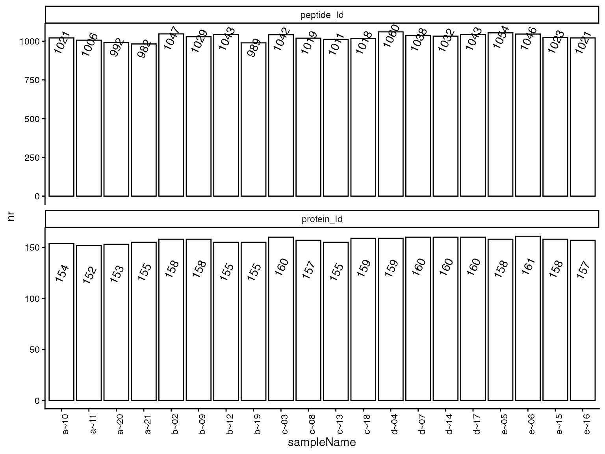
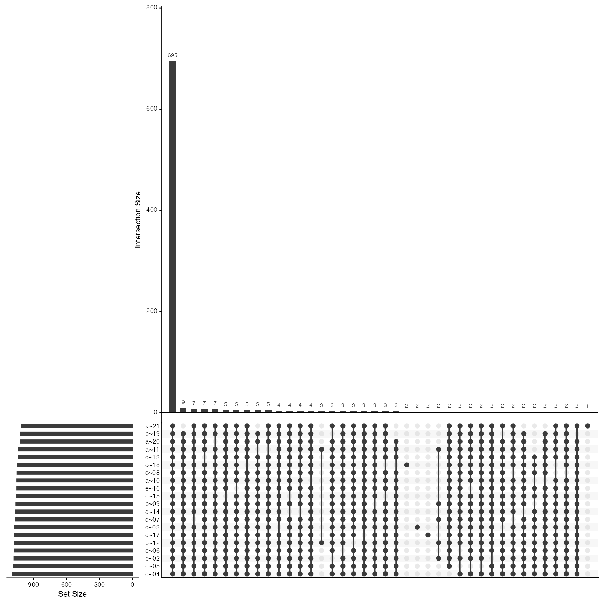
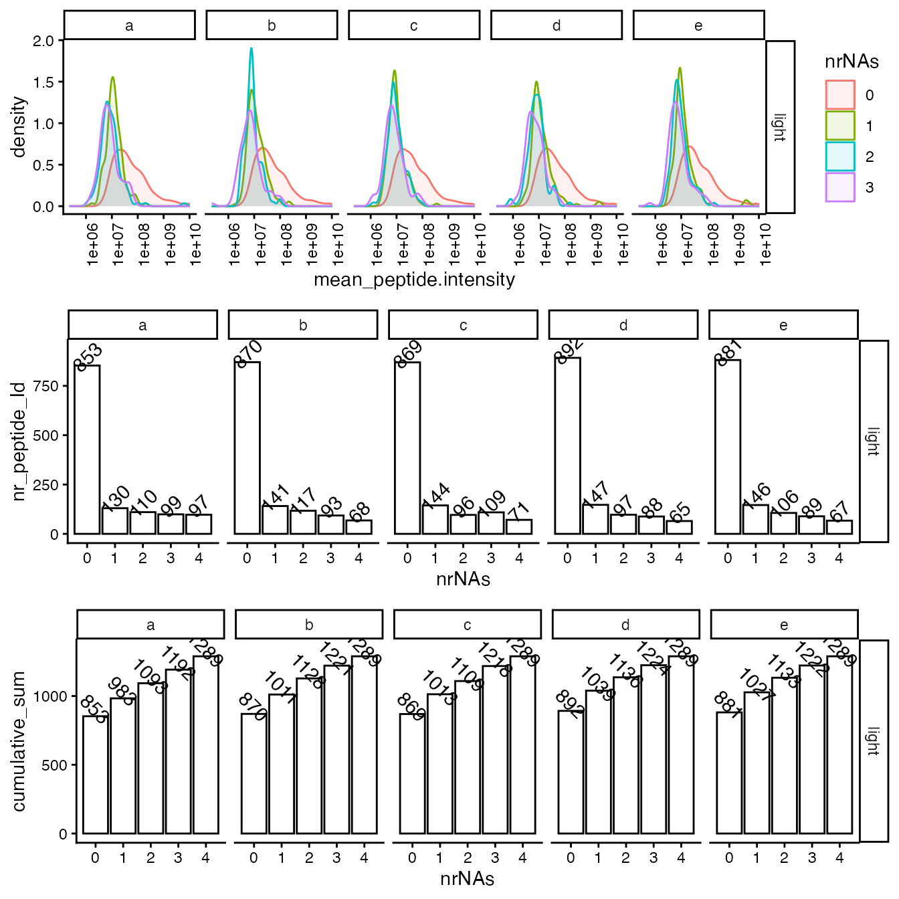
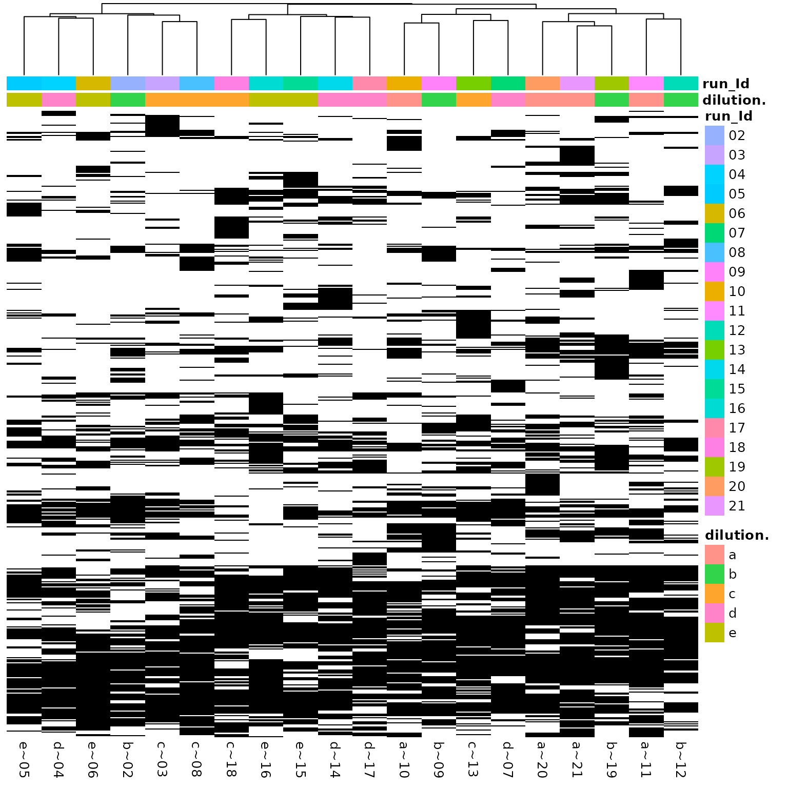
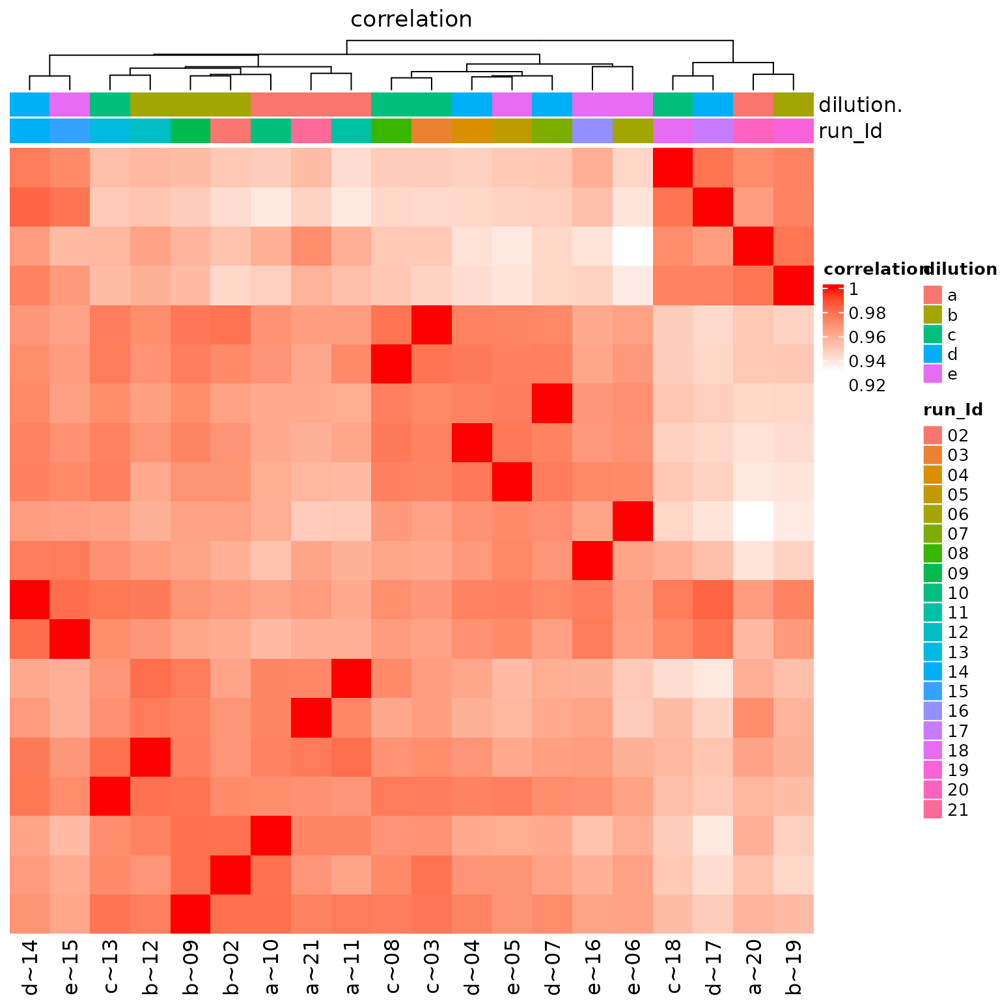
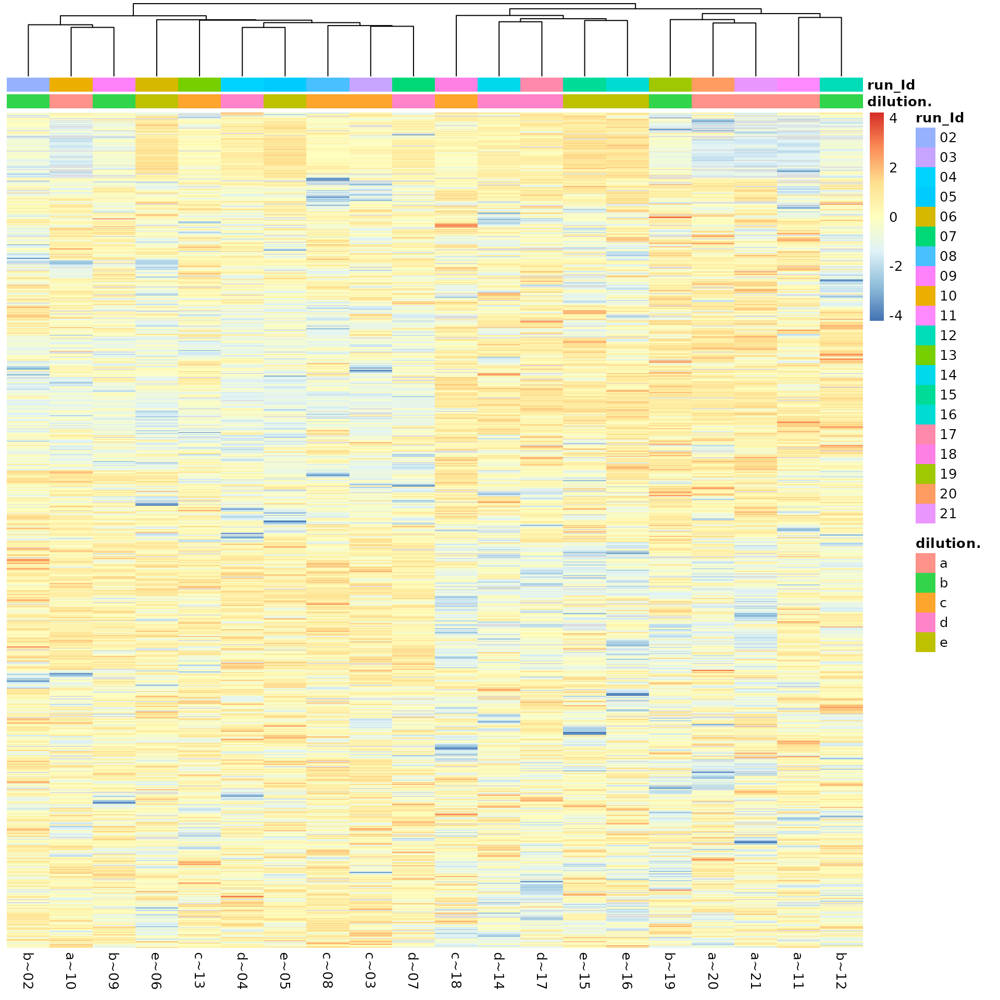
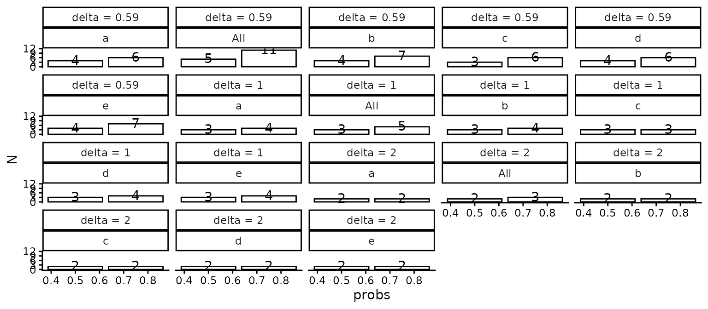

# Quality Control & Sample Size Estimation

## Introduction

- Workunit:
- Project:
- Order :

We did run your samples through the same analysis pipeline, which will
be applied in the main experiment. This document summarizes the protein
variability to assess the reproducibility of the biological samples and
estimates the sample sizes needed for the main experiment.

## Quality Control: Identifications and Quantifications

Here we summarize the number of proteins measured in the QC experiment.
Depending on the type of your sample (e.g., pull-down, supernatant,
whole cell lysate) we observe some dozens up to a few thousands of
proteins. While the overall number of proteins can highly vary depending
of the type of experiment, it is crucial that the number of proteins
between your biological replicates is similar (reproducibility).

| NR.isotope | NR.protein_Id | NR.peptide_Id |
|:-----------|--------------:|--------------:|
| light      |           163 |          1258 |

Nr of proteins detected in all samples.

(ref:hierarchyCountsSampleBarplot) Number of quantified proteins per
sample. Each bar represents one LC-MS sample and the y-axis shows the
count of quantified proteins.

(ref:hierarchyCountsSampleBarplot)

(ref:hierarchyCountsSample) Overlap of quantified proteins across
samples. Bars show set and intersection sizes, and filled dots mark
which samples contribute to each intersection.

(ref:hierarchyCountsSample)

Ideally, we identify each protein in all of the samples. However,
because of the limit of detection (LOD) low-intensity proteins might not
be observed in all samples. Ideally, the LOD should be the only source
of missingness in biological replicates. The following figures help us
to verify the reproducibility of the measurement at the level of missing
data.

(ref:missingFigIntensityHistorgram) Missing-value structure across
protein quantifications. The upper panel shows intensity distributions
grouped by the number of missing values, and the lower panels show
counts and cumulative counts of missing values per group.

(ref:missingFigIntensityHistorgram)

(ref:missingnessHeatmap) Missing protein quantifications clustered by
sample. Rows are proteins, columns are samples, and the heatmap marks
observed and missing measurements.

(ref:missingnessHeatmap)

### Variability of raw intensities

Before intensity scaling and preprocessing, the protein intensities
should have comparable distributions across samples. We assess this with
protein -level coefficient of variation (CV) densities (Figure
@ref(fig:plotDistributions)) and sample-level raw versus transformed
intensity distributions (Figure @ref(fig:intensityDistribution)). Table
@ref(tab:printTable) summarizes CV quantiles.

(ref:plotDistributions) Distribution of protein-level coefficients of
variation (CV) before transformation. The left panel shows CV densities
by group, and the right panel splits proteins into below- and
above-median abundance strata.

(ref:plotDistributions)

| probs |        e |        a |        b |        c |        d |      All |
|------:|---------:|---------:|---------:|---------:|---------:|---------:|
|   0.5 | 19.84150 | 17.19356 | 18.27516 | 18.27122 | 18.34845 | 22.33335 |
|   0.6 | 22.59270 | 20.18408 | 21.12670 | 21.04286 | 21.46828 | 25.65000 |
|   0.7 | 25.93725 | 23.50090 | 24.87077 | 24.89460 | 25.27467 | 30.15509 |
|   0.8 | 32.05808 | 28.34406 | 30.73163 | 31.43322 | 31.74267 | 35.63108 |
|   0.9 | 42.68712 | 41.05645 | 40.27659 | 43.83096 | 40.84628 | 43.73533 |

Summary of the coefficient of variation (CV) at the 50th, 60th, 70th,
80th and 90th percentile.

### Variability of transformed intensities

We applied the
[`vsn::justvsn`](https://rdrr.io/pkg/vsn/man/justvsn.html) normalization
to the data, which should remove systematic differences among the
samples and reduce the variance within the groups. Figure
@ref(fig:intensityDistribution) shows the sample-level intensity
distributions before and after transformation. Because of this
transformation, we cannot report CVs on the transformed scale and
instead report standard deviations (SD). Figure @ref(fig:sdviolinplots)
shows the distribution of protein SDs, Figure @ref(fig:sdecdf) shows
their empirical cumulative distribution function (ECDF), and Table
@ref(tab:printSDTable) summarizes SD quantiles. The heatmap in Figure
@ref(fig:correlationHeat) shows correlations among the QC samples.

(ref:intensityDistribution) Sample-level intensity distributions before
and after transformation. The left panel shows raw protein intensities,
the right panel shows transformed intensities, and each curve or violin
represents one sample.

(ref:intensityDistribution)

(ref:correlationHeat) Sample correlation heatmap after transformation.
Rows and columns are samples, and colours encode pairwise correlations
of transformed protein intensities.

(ref:correlationHeat)

Pairwise scatter plots of transformed sample intensities. Each panel
compares two samples, and smoothed trends show agreement between
samples.

(ref:sdviolinplots) Distribution of protein standard deviations after
transformation. The left panel shows SD densities by group, and the
right panel splits proteins into below- and above-median abundance
strata.

(ref:sdviolinplots)

(ref:sdecdf) Empirical cumulative distribution function (ECDF) of
protein standard deviations after transformation. The left panel shows
SD ECDFs by group, and the right panel splits proteins into below- and
above-median abundance strata.

(ref:sdecdf)

| probs |         e |         a |         b |         c |         d |       All |
|------:|----------:|----------:|----------:|----------:|----------:|----------:|
|   0.5 | 0.1970862 | 0.1946647 | 0.1944917 | 0.1910686 | 0.1980979 | 0.2702206 |
|   0.6 | 0.2421660 | 0.2369077 | 0.2377510 | 0.2362158 | 0.2395528 | 0.3311495 |
|   0.7 | 0.3013293 | 0.2932444 | 0.2978505 | 0.2849253 | 0.2955599 | 0.4071946 |
|   0.8 | 0.3795823 | 0.3715429 | 0.3863823 | 0.3637895 | 0.3720552 | 0.5257856 |
|   0.9 | 0.5626683 | 0.5540956 | 0.5632134 | 0.5814590 | 0.5437999 | 0.7131470 |

Summary of the distribution of standard deviations at the 50th, 60th,
70th, 80th and 90th percentile.

(ref:overviewHeat) Heatmap of transformed protein intensities across
samples. Rows are proteins, columns are samples, and colours encode
transformed intensity.

(ref:overviewHeat)

## Sample Size Calculation

In the previous section, we estimated protein variance from the QC
samples. Figure @ref(fig:sdviolinplots) shows the distribution of
standard deviations after transformation. We use these SD estimates,
together with typical significance and power settings, to estimate the
sample sizes needed for the main experiment.

An important factor in estimating sample size is the smallest effect
size you want to detect between two conditions, such as a reference and
a treatment. Smaller biologically relevant effects require more samples.
Typical $log_{2}$ fold-change thresholds are $0.59,1,2$, corresponding
to fold changes of $1.5,2,4$.

Table @ref(tab:sampleSize) and Figure @ref(fig:figSampleSize) summarize
how many samples are needed to detect $log_{2}$ fold-change differences
of $0.59,1,2$ at a significance level of $5\%$ and power of $80\%$,
using the SD quantiles for $50\%$ and $75\%$ of the measured proteins.

(ref:figSampleSize) Estimated sample size for detecting $log_{2}$
fold-change differences by t-test. Bars show the number of samples
required at significance level $0.05$ and power $0.8$ for the 50% and
75% SD quantiles of the measured proteins; facets show the tested effect
sizes.

(ref:figSampleSize)

| probs | sdtrimmed | dilution. | delta = 0.59 | delta = 1 | delta = 2 |
|------:|----------:|:----------|-------------:|----------:|----------:|
|  0.50 | 0.1970862 | e         |            4 |         3 |         2 |
|  0.75 | 0.3302951 | e         |            7 |         4 |         2 |
|  0.50 | 0.1946647 | a         |            4 |         3 |         2 |
|  0.75 | 0.3276262 | a         |            6 |         4 |         2 |
|  0.50 | 0.1944917 | b         |            4 |         3 |         2 |
|  0.75 | 0.3327904 | b         |            7 |         4 |         2 |
|  0.50 | 0.1910686 | c         |            3 |         3 |         2 |
|  0.75 | 0.3177703 | c         |            6 |         3 |         2 |
|  0.50 | 0.1980979 | d         |            4 |         3 |         2 |
|  0.75 | 0.3266973 | d         |            6 |         4 |         2 |
|  0.50 | 0.2702206 | All       |            5 |         3 |         2 |
|  0.75 | 0.4619799 | All       |           11 |         5 |         3 |

Estimated sample size required to detect each tested log2 fold-change
difference at significance level 0.05 and power 0.8 with a t-test.

The *power* of a test is $1 - \beta$, where $\beta$ is the probability
of a Type 2 error (failing to reject the null hypothesis when the
alternative hypothesis is true). In other words, if you have a $20\%$
chance of failing to detect a real difference, then the power of your
test is $80\%$.

The *confidence level* is equal to $1 - \alpha$, where $\alpha$ is the
probability of making a Type 1 Error. That is, alpha represents the
chance of a falsely rejecting $H_{0}$ and picking up a false-positive
effect. Alpha is usually set at $5\%$ significance level, for a $95\%$
confidence level.

Fold change: Suppose you are comparing a treatment group to a placebo
group, and you will be measuring some continuous response variable
which, you hypothesize, will be affected by the treatment. We can
consider the mean response in the treatment group, $\mu_{1}$, and the
mean response in the placebo group, $\mu_{2}$. We can then define
$\Delta = \mu_{1} - \mu_{2}$ as the mean difference. The smaller the
difference you want to detect, the larger the required sample size.

## Appendix

| raw.file                                                         | sampleName | dilution. | run_Id |
|:-----------------------------------------------------------------|:-----------|:----------|:-------|
| b03_10_150304_human_ecoli_a_3ul_3um_column_95_hcd_ot_2hrs_30b_9b | a~10       | a         | 10     |
| b03_11_150304_human_ecoli_a_3ul_3um_column_95_hcd_ot_2hrs_30b_9b | a~11       | a         | 11     |
| b03_20_150304_human_ecoli_a_3ul_3um_column_95_hcd_ot_2hrs_30b_9b | a~20       | a         | 20     |
| b03_21_150304_human_ecoli_a_3ul_3um_column_95_hcd_ot_2hrs_30b_9b | a~21       | a         | 21     |
| b03_02_150304_human_ecoli_b_3ul_3um_column_95_hcd_ot_2hrs_30b_9b | b~02       | b         | 02     |
| b03_09_150304_human_ecoli_b_3ul_3um_column_95_hcd_ot_2hrs_30b_9b | b~09       | b         | 09     |
| b03_12_150304_human_ecoli_b_3ul_3um_column_95_hcd_ot_2hrs_30b_9b | b~12       | b         | 12     |
| b03_19_150304_human_ecoli_b_3ul_3um_column_95_hcd_ot_2hrs_30b_9b | b~19       | b         | 19     |
| b03_03_150304_human_ecoli_c_3ul_3um_column_95_hcd_ot_2hrs_30b_9b | c~03       | c         | 03     |
| b03_08_150304_human_ecoli_c_3ul_3um_column_95_hcd_ot_2hrs_30b_9b | c~08       | c         | 08     |
| b03_13_150304_human_ecoli_c_3ul_3um_column_95_hcd_ot_2hrs_30b_9b | c~13       | c         | 13     |
| b03_18_150304_human_ecoli_c_3ul_3um_column_95_hcd_ot_2hrs_30b_9b | c~18       | c         | 18     |
| b03_04_150304_human_ecoli_d_3ul_3um_column_95_hcd_ot_2hrs_30b_9b | d~04       | d         | 04     |
| b03_07_150304_human_ecoli_d_3ul_3um_column_95_hcd_ot_2hrs_30b_9b | d~07       | d         | 07     |
| b03_14_150304_human_ecoli_d_3ul_3um_column_95_hcd_ot_2hrs_30b_9b | d~14       | d         | 14     |
| b03_17_150304_human_ecoli_d_3ul_3um_column_95_hcd_ot_2hrs_30b_9b | d~17       | d         | 17     |
| b03_05_150304_human_ecoli_e_3ul_3um_column_95_hcd_ot_2hrs_30b_9b | e~05       | e         | 05     |
| b03_06_150304_human_ecoli_e_3ul_3um_column_95_hcd_ot_2hrs_30b_9b | e~06       | e         | 06     |
| b03_15_150304_human_ecoli_e_3ul_3um_column_95_hcd_ot_2hrs_30b_9b | e~15       | e         | 15     |
| b03_16_150304_human_ecoli_e_3ul_3um_column_95_hcd_ot_2hrs_30b_9b | e~16       | e         | 16     |

Mapping of raw file names to sample names used throughout this report.

| isotope | sampleName | protein_Id | peptide_Id |
|:--------|:-----------|-----------:|-----------:|
| light   | a~10       |        154 |       1021 |
| light   | a~11       |        152 |       1006 |
| light   | a~20       |        153 |        992 |
| light   | a~21       |        155 |        982 |
| light   | b~02       |        158 |       1047 |
| light   | b~09       |        158 |       1029 |
| light   | b~12       |        155 |       1043 |
| light   | b~19       |        155 |        989 |
| light   | c~03       |        160 |       1042 |
| light   | c~08       |        157 |       1019 |
| light   | c~13       |        155 |       1011 |
| light   | c~18       |        159 |       1018 |
| light   | d~04       |        159 |       1060 |
| light   | d~07       |        160 |       1038 |
| light   | d~14       |        160 |       1032 |
| light   | d~17       |        160 |       1043 |
| light   | e~05       |        158 |       1054 |
| light   | e~06       |        161 |       1046 |
| light   | e~15       |        158 |       1023 |
| light   | e~16       |        157 |       1021 |

Number of quantified proteins per sample.
