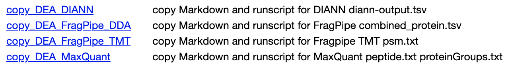
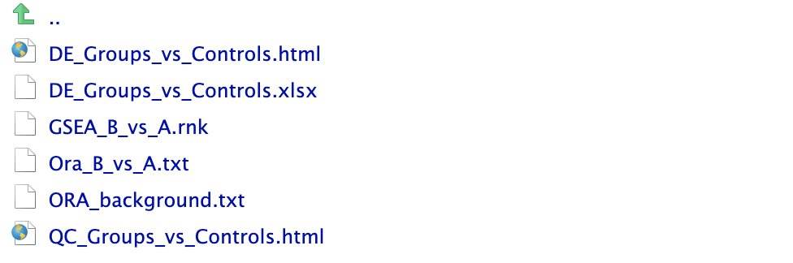
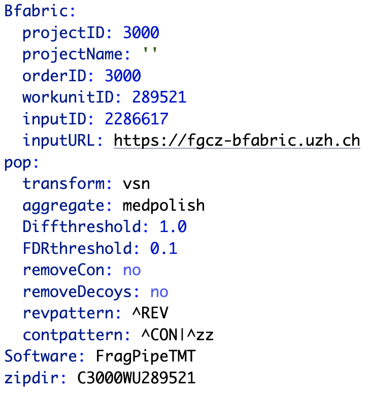
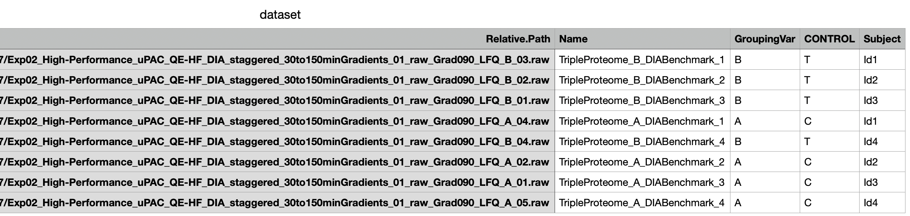

```{r setup, include=FALSE}
options(width = 999)
knitr::opts_chunk$set(echo = FALSE, warning = FALSE, message = FALSE, fig.width = 7, fig.height = 5)
ggplot2::theme_set(ggplot2::theme_classic())

```

# Introduction

- Protein differential expression analysis (DEA) for
  DIANN, FragPipe DDA, FragPipe TMT, MaxQuant outputs, or MSstats inputs.
- Uses preprocessing and statistical models implemented in the `R` package `prolfqua` <br/>
[doi.org/10.1021/acs.jproteome.2c00441](https://pubs.acs.org/doi/10.1021/acs.jproteome.2c00441)
- Generates dynamic HTML reports
- Exports results as XLSX files, `.rnk` and `.txt` files for GSEA and ORA
- Archived analysis can easily be replicate on any system running `R` (>= 4.1)


# How To

Install `R` and `prolfquapp`

```{r echo=TRUE, eval=FALSE}
install.packages('remotes')
remotes::install_github('wolski/prolfquapp', dependencies = TRUE)
```

Create a directory with :

- config.yaml (parameter file)
- dataset.csv (experimental design) 
- the FASTA file
- DIANN, FragPipe or MaxQuant results

Copy the `R` code into the working directory by running one of the functions: 

```{r directory, out.width="90%"}

```

The content of the working directory is:

```{r dirsetup, out.width="90%"}
knitr::include_graphics("pa_directory_setup.png")
```

Finally, from `R` console `source("FP_DIA.R")`,
or execute `Rscript FP_DIA.R`. This
creates a subfolder with the DEA results.

```{r startdirectory, out.width="90%"}

```

- DE_Groups_vs_Controls.html report describing the main steps of the analysis and shows the results.
- DE_Groups_vs_Controls.xlsx contains the raw and transformed abundances, annotations, results of the differential expression analysis.
- `.rnk`, and `.txt` files for GSEA and ORA analysis
- Diagnostic plots for each proteins (boxplots, lineplots for peptide abundances)

The entire working directory including input data, R code and results is archived. You can unzip it later and replicate the analysis using your R installation.

## Analysis parameters

The `config.yaml` file specifies the parameters of the analysis:

* project related information e.g. projectID, is shown in the HTML report
* aggregation method <br/>
(`medpolish`, `rlm`, `top_3`)
* abundance transformation <br/>
(`robscale`, `vsn`, `none`),
* FDR and effect size thresholds


```{r configyml, out.width="60%", include = TRUE}

```

## Sample annotation

The `dataset.csv` file contains the information about the measured samples:

- Relative.Path/Path/raw.file/channel/ (unique)
- name - used in plots and figures (unique)
- group/experiment - main factor
- subject/bioreplicate (optional) - blocking factor
- control - used to specify the control condition (C) (optional)

The column names are not case sensitive.

```{r pairedAnlaysis, out.width = "90%"}

```

If subject is specified then the model is `abundance ~ group + subject`, otherwise
 `abundance ~ group`. The group differences to compute are determined from the group and control columns. MSstats anntotation.csv and dataset.csv are similar.


# HTML Report

- Project related information (project ID etc)
- Primary introduction to DEA
- Sums up the design of the experiment
- Summarizes of protein ident. and quant.: <br/> missigness, CV, clustering, PCA
- DEA results with volcano plots and tables (they interact using `crosslink`)
- Explains output formats, gives pointers to follow up analysis (GSEA, ORA)

# Summary

- Integrates into LIMS system <br/>
[doi.org/10.1515/jib-2022-0031](https://doi.org/10.1515/jib-2022-0031)
- Archived working directory contains the results and all the data needed to replicate analysis
 on your PC
- User-friendly data formats (XLSX, txt, rnk)

```{r htmlreport, out.width="105%"}
knitr::include_graphics("HTMLasImage.png")
```

# Download

https://github.com/fgcz/prolfqua
https://github.com/wolski/prolfquapp

```{r url, out.width="65%",fig.show='hold', fig.align="center"}
library(qrcode)
par(mfrow = c(1,2))
code1 <- qrcode::qr_code("https://github.com/fgcz/prolfqua")
par(mai = rep(0, 4), mar = c(0,0,1.5,0))
image(code1, asp = 1, col = c("white","black"), axes = FALSE, main = "prolfqua")
code2 <- qrcode::qr_code("https://github.com/wolski/prolfquapp")
image(code2, asp = 1, col = c("white","black"), axes = FALSE, main = "prolfquapp")

```


