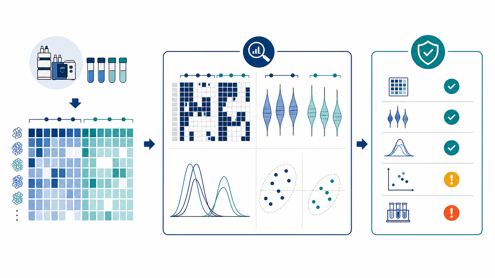

```{r setup}
#| include: false
knitr::opts_chunk$set(
  echo = FALSE,
  message = FALSE,
  warning = FALSE,
  out.width = "600px",
  fig.align = "center"
)

deanalyse_file <- params$deanalyse_file
if (is.null(deanalyse_file) || !nzchar(deanalyse_file)) {
  deanalyse_file <- file.path(tempdir(), "prolfquapp-example-deanalyse.rds")
  if (!file.exists(deanalyse_file)) {
    saveRDS(prolfquapp::example_deanalyse(), deanalyse_file)
  }
}
dea <- readRDS(deanalyse_file)
cfg <- dea$prolfq_app_config

report_html_attr <- function(x) {
  value <- prolfquapp:::.report_provenance_scalar(x)
  value <- gsub("&", "&amp;", value, fixed = TRUE)
  value <- gsub('"', "&quot;", value, fixed = TRUE)
  value <- gsub("<", "&lt;", value, fixed = TRUE)
  value <- gsub(">", "&gt;", value, fixed = TRUE)
  value
}

project_spec <- cfg$project_spec
report_metadata <- prolfquapp:::.report_provenance(
  project_spec = project_spec,
  software = cfg$software,
  model = dea$default_model
)
```

```{r report-metadata-marker}
#| results: asis
cat(sprintf(
  paste0(
    '<div id="fgcz-report-metadata" hidden ',
    'data-project-id="%s" data-order-id="%s" data-workunit-id="%s" ',
    'data-generated-by="%s" data-generated-at="%s"></div>\n'
  ),
  report_html_attr(report_metadata$project_id),
  report_html_attr(report_metadata$order_id),
  report_html_attr(report_metadata$workunit_id),
  report_html_attr(report_metadata$creator),
  report_html_attr(report_metadata$created_at)
))
```

::: {.panel-tabset}

# Overview

```{r overview-data-summary}
#| results: asis
cat(prolfquapp:::.report_overview_cards(dea$lfq_data_raw))
```



This report checks whether quantified protein abundances are suitable for differential-expression interpretation. It examines missing values, within-group variability, abundance distributions, and sample structure before the differential-expression diagnostics are read.

Input: quantified protein abundances from `r nrow(dea$lfq_data_raw$factors())` samples, analysed with `r report_metadata$software`.

# Missing Values

Missing values can reveal potential biases or technical problems in the data. @fig-missing-protein summarizes missing protein abundance estimates per group. Panel A shows how many proteins have $0-N$ missing values. Ideally, most proteins are quantified in all samples within a group. Panel B shows the distribution of mean protein intensity by the number of missing values. Proteins without missing values usually have higher average abundance than proteins with one or more missing values because low-abundance proteins are more likely to remain undetected. Strongly overlapping distributions can point to other sources of missingness, such as large sample heterogeneity or technical problems.

```{r}
#| label: fig-missing-protein
#| fig-cap: "Missing protein abundance estimates by group. Panel A: number of proteins with n missing values (nrNA). Panel B: distribution of mean within-group protein intensity by the number of missing values."
#| fig-height: 5
#| fig-width: 8
#| out-width: "600px"
pl <- dea$lfq_data_raw$get_Plotter()
p2 <- pl$missigness_histogram()

sr <- dea$lfq_data_raw$get_Summariser()
p1 <- sr$plot_missingness_per_group()

gridExtra::grid.arrange(
  p1 + ggplot2::labs(tag = "A"),
  p2 + ggplot2::labs(tag = "B"),
  nrow = 2
)
```

# Variance

Panel A in @fig-sd-violin shows the coefficients of variation (CVs) for all proteins computed from non-normalized data. Ideally, the within-group CV should be smaller than the CV across all samples. Panel B shows the standard deviation distribution for log2-transformed data, while panel C shows the corresponding distribution after normalization. Normalization should reduce within-group variance compared with the overall variance. If normalization increases within-group variance relative to the overall variance, the selected normalization method may not be compatible with the data.

```{r}
#| label: fig-sd-violin
#| fig-cap: "Protein-level variance distributions. Panel A: coefficients of variation (CVs) within groups and across the full experiment (all) for non-normalized data. Panel B: standard deviations (SDs) for log2-transformed data. Panel C: SDs after normalization. Black dots indicate medians."
#| fig-height: 3
#| fig-width: 7
#| out-width: "600px"
stR <- dea$lfq_data_raw$get_Stats()
pA <- stR$violin() + ggplot2::theme_classic() +
  ggplot2::labs(tag = "A") +
  ggplot2::theme(axis.text.x = ggplot2::element_text(angle = 45, hjust = 1))
st <- dea$lfq_data$get_Stats()
pC <- st$violin() +
  ggplot2::theme_classic() +
  ggplot2::labs(tag = "C") +
  ggplot2::theme(axis.text.x = ggplot2::element_text(angle = 45, hjust = 1))

lfqData <- dea$lfq_data_raw
tr <- lfqData$get_Transformer()
tmp <- tr$log2()$lfq
stback <- tmp$get_Stats()
pB <- stback$violin() +
  ggplot2::theme_classic() +
  ggplot2::labs(tag = "B") +
  ggplot2::theme(axis.text.x = ggplot2::element_text(angle = 45, hjust = 1))

gridExtra::grid.arrange(pA, pB, pC, nrow = 1)
```

@tbl-cv shows the median CV and SD values for all groups and across all samples (`all`).

```{r}
#| label: tbl-cv
#| tbl-cap: "Median (50th-percentile) coefficient of variation (CV, from non-normalized data) and standard deviation (SD) for log2-transformed (sd_log2) and normalized (sd) data, per group and across all samples (all)."
resR <- stR$stats_quantiles()
res <- st$stats_quantiles()
reslog2 <- stback$stats_quantiles()

C <- dplyr::bind_rows(
  CV = resR$wide |> dplyr::filter(probs == 0.5) |> round(digits = 2),
  sd_log2 = reslog2$wide |> dplyr::filter(probs == 0.5) |> round(digits = 2),
  sd = res$wide |> dplyr::filter(probs == 0.5) |> round(digits = 2)
)

C <- C |>
  dplyr::mutate(what = c("CV", "sd_log2", "sd"), .before = 1)

C$probs <- NULL
knitr::kable(C)
```

# Differential Expression

Most proteins in a dataset are usually not differentially expressed; therefore, differences between the two groups should be centered close to zero. @fig-fc-density shows the distribution of group differences for all proteins. Ideally, the median of this distribution (red line) should be close to zero (green line). If the median and mode of the difference distribution are non-zero, this should be considered when interpreting the differential expression results.

Panel B in @fig-fc-density shows the distribution of p-values for all proteins. If the null hypothesis is true, p-values should be approximately uniformly distributed. A subset of differentially expressed proteins produces a higher frequency of small p-values. A higher frequency of large p-values close to 1 can indicate that the linear model does not describe the variance of the data well, for example because of outliers or an unmodeled source of variability.

```{r}
#| label: fig-fc-density
#| fig-cap: "Differential expression diagnostic distributions. Panel A: differences between groups for all proteins. The red dotted line marks the median fold change; the green line marks the expected median fold change. Panel B: histogram of p-values for all proteins."
#| fig-width: 8
#| fig-height: 4
#| out-width: "600px"
cpl <- dea$contrast_results[[dea$default_model]]$get_Plotter(
  fc_threshold = cfg$processing_options$diff_threshold,
  fdr_threshold = cfg$processing_options$FDR_threshold)
p1 <- cpl$histogram_diff() + ggplot2::labs(tag = "A")
p2 <- cpl$histogram()$p.value + ggplot2::labs(tag = "B")
gridExtra::grid.arrange(p1, p2)
```

The MA plot in @fig-ma helps identify whether large fold changes are concentrated among high- or low-abundance proteins. Panel A shows the group difference (y-axis) as a function of average protein abundance (x-axis). The observed fold change should not depend on protein abundance. Panel B shows the same group difference against the rank of average protein abundance.

```{r}
#| label: fig-ma
#| fig-cap: "MA plot diagnostics. Panel A: group difference versus average protein abundance. Panel B: group difference versus the rank of average protein abundance."
#| fig-width: 8
#| fig-height: 5
#| out-width: "600px"
cpl <- dea$contrast_results[[dea$default_model]]$get_Plotter(
  fc_threshold = cfg$processing_options$diff_threshold,
  fdr_threshold = cfg$processing_options$FDR_threshold)
ppb <- cpl$ma_plot(rank = FALSE) + ggplot2::labs(tag = "A")
ppc <- cpl$ma_plot(fc = cfg$processing_options$diff_threshold, rank = TRUE) + ggplot2::labs(tag = "B")
gridExtra::grid.arrange(ppb, ppc, ncol = 1)
```

# Session Info

::: {.panel-tabset}

## Report provenance

```{r}
#| label: tbl-report-metadata
#| tbl-cap: "Compact report provenance, including the source input-data reference."
knitr::kable(prolfquapp:::.report_provenance_table(report_metadata))
```

## R session info

```{r session-info}
sessionInfo()
```

:::

:::
