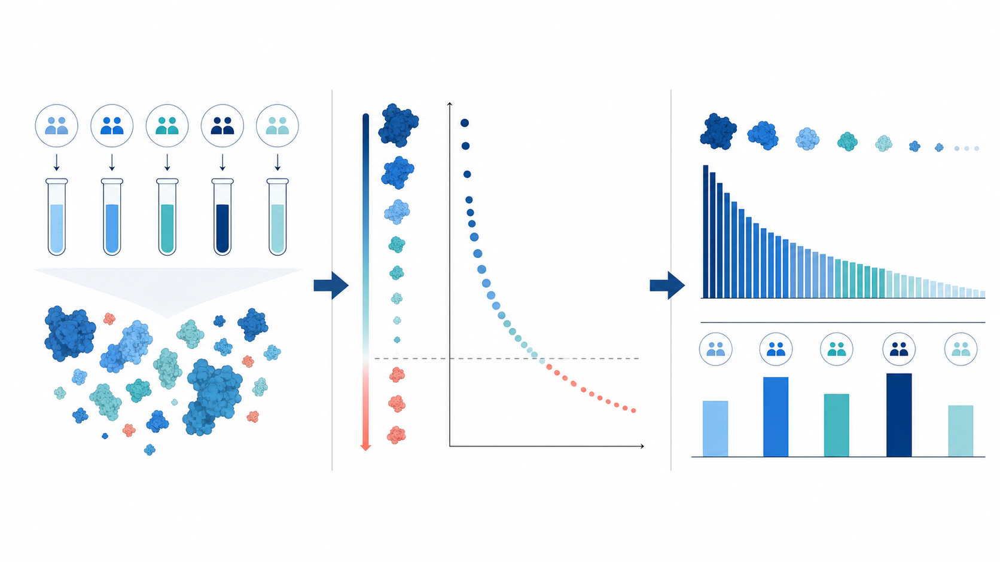

```{r setup, include=FALSE}
library(ggplot2)
library(dplyr)
knitr::opts_chunk$set(
  echo = FALSE,
  message = FALSE,
  warning = FALSE,
  fig.width = 6.5,
  fig.height = 6.5,
  fig.align = "center"
)

pap_file <- params$pap_file
if (is.null(pap_file) || !nzchar(pap_file)) {
  pap_file <- file.path(tempdir(), "prolfquapp-example-qc-generator.rds")
  if (!file.exists(pap_file)) {
    saveRDS(prolfquapp::example_qc_generator(), pap_file)
  }
}
pap <- readRDS(pap_file)
lfqdataProt <- pap$lfqdata_prot
tableconfig <- pap$lfqdata_prot$get_config()
factors <- params$factors
project_info <- params$project_info
if (is.null(project_info)) {
  project_info <- list()
}
report_provenance <- prolfquapp:::.report_provenance(
  project_spec = project_info
)

```

::: {.panel-tabset}

# Overview

```{r overview-data-summary}
#| results: asis
cat(prolfquapp:::.report_overview_cards(lfqdataProt))
```



This report profiles how quantified protein signal is distributed across sample groups. It identifies dominant proteins and potential contaminants, then compares the number of quantified proteins per sample.

Input: quantified protein abundances from `r nrow(lfqdataProt$factors())` samples. The detailed source-data reference is recorded in **Session Info**.

# Protein abundances

```{r createPlot}
protID <- tableconfig$hierarchy_keys_depth()

precabund <- pap$get_protein_per_group_abundance()
if (!factors) {
  precabund <- dplyr::filter(precabund, !!sym(tableconfig$factor_keys()[1]) == "ALL")
}


pp <- prolfquapp::plot_abundance_vs_percent(
  precabund,
  cfg_config = tableconfig,
  top_N = NULL,
  factors = factors,
  colors = c("^zz" = "red", "Y-FGCZ" = "red"),
  columnAb = "abundance_percent",
  alpha = 0.4,
  highlight_alpha = 0.8,
  logY = TRUE)
pp <- plotly::ggplotly(pp)
```

```{r createDT}
precabund_table <- pap$get_protein_per_group_small_wide()
datax <- crosstalk::SharedData$new(
  as.data.frame(precabund_table),
  key = as.formula(paste(" ~ ", protID)),
  group = "BB")

table <- DT::datatable(
  datax,
  filter = "bottom",
  extensions = "Scroller",
  style = "auto",
  class = "compact",
  options = list(
    deferRender = TRUE,
    scrollY = 300,
    scrollX = 400,
    scroller = TRUE
  ))


```

```{r}
#| label: fig-protein-cumulative
#| fig-dpi: 96
#| fig-cap: "Per-protein iBAQ signal contribution versus abundance rank, one panel per group. Each point is one protein; the x-axis is the protein's abundance-rank percentile (proteins ordered from lowest to highest mean iBAQ abundance) and the y-axis (log10 scale) is the percentage of the total iBAQ (intensity-based absolute quantification) signal contributed by that protein. Contaminant and decoy proteins are highlighted in red."
pp
```

```{r}
table
```

::: {.callout-note collapse="true"}
## Table columns
The columns of the protein abundance table contain:

- `protein_Id` - protein identifier
- `nrPeptides` - number of peptides assigned to the protein
- `description` - protein description from the FASTA header
- `nrMeasured_<GroupName>` - number of samples in which the protein was quantified, by group and overall
- `meanAbundance_<GroupName>` - mean protein abundance per group
- `signal_percent_<GroupName>` - percentage of the total protein signal attributed to the protein
:::

::: {.callout-note collapse="true"}
## What is the iBAQ signal?
The iBAQ signal per protein is calculated by summing the `Precursor.Quantity` values across all precursors assigned to the protein and dividing by the number of theoretically observable peptides. A large share of the recorded signal can be concentrated in a small set of highly abundant proteins. If the dominant proteins are the cleavage enzyme, common contaminants such as human keratins, or the bait protein, this can indicate shortcomings in sample preparation or cleanup.
:::

# Proteins per sample

```{r}
#| label: fig-hierarchy-counts-sample
#| fig-cap: "Number of proteins quantified per sample."
srs <- lfqdataProt$get_Summariser()
srs$plot_hierarchy_counts_sample()
```

# Session Info

::: {.panel-tabset}

## Report provenance

```{r}
#| label: tbl-report-provenance
#| tbl-cap: "Compact report provenance, including the source input-data reference."
knitr::kable(prolfquapp:::.report_provenance_table(report_provenance))
```

## R session info

```{r}
#| label: session-info
sessionInfo()
```

:::

:::
