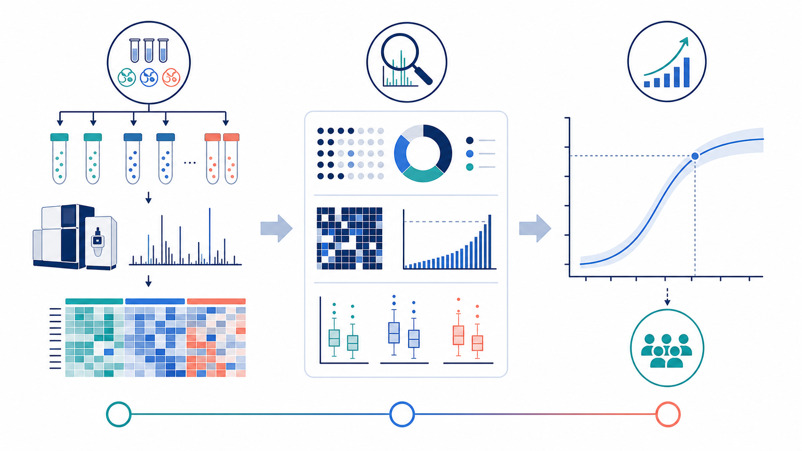

```{r setup}
#| include: false
library(rlang)
library(prolfqua)
library(ggplot2)

knitr::opts_chunk$set(
  echo = FALSE,
  message = FALSE,
  warning = FALSE,
  fig.width = 5.5,
  fig.height = 3.5,
  out.width = "66%",
  fig.align = "center"
)

qc_file <- params$qc_data_file
if (is.null(qc_file) || !nzchar(qc_file)) {
  ds <- prolfqua::prolfqua_data("data_ionstar")$filtered()
  qc_file <- file.path(tempdir(), "prolfquapp-example-qc-sse.rds")
  if (!file.exists(qc_file)) {
    saveRDS(
      list(data = ds$data, configuration = ds$config$clone(deep = TRUE)),
      qc_file
    )
  }
}
qc <- readRDS(qc_file)
data <- qc$data
local_config <- qc$configuration

local_project_conf <- params$project_conf
if (is.null(local_project_conf)) {
  local_project_conf <- list()
}

plot_density <- params$plot_density
if (is.null(plot_density)) {
  plot_density <- TRUE
}

plot_sd_vs_mean <- params$plot_sd_vs_mean
if (is.null(plot_sd_vs_mean)) {
  plot_sd_vs_mean <- FALSE
}
old.theme <- ggplot2::theme_set(ggplot2::theme_classic())

lfqdata <- prolfqua::LFQData$new(data, local_config)
nrSamples <- nrow(lfqdata$factors())

string_translations <- list(
  "metabolite" = list(
    "target" = "metabolite",
    "targets" = "metabolites",
    ".analyzed_target_types" = "metabolites"
  ),
  "peptide" = list(
    "target" = "peptide",
    "targets" = "peptides",
    ".analyzed_target_types" = "proteins and peptides"
  ),
  "protein" = list(
    "target" = "protein",
    "targets" = "proteins",
    ".analyzed_target_types" = "proteins"
  )
)
strings <- string_translations[[params$target_type]]
report_provenance <- prolfquapp:::.report_provenance(
  project_spec = local_project_conf
)

```

::: {.panel-tabset}

# Overview

```{r overview-data-summary}
#| results: asis
cat(prolfquapp:::.report_overview_cards(
  lfqdata,
  feature_label = tools::toTitleCase(strings[["targets"]])
))
```



We ran your samples through the same analysis pipeline that will be applied to the main experiment. This document summarizes the `r strings[["target"]]` variability, assesses the reproducibility of the biological samples, and estimates the sample sizes needed for the main experiment.

Input: a pilot data set with `r nrSamples` samples and quantified `r strings[["targets"]]`. The detailed source-data reference is recorded in **Session Info**.

The **Quality Control** tab describes detection, reproducibility, abundance distributions, and variability. **Sample Size Calculation** then uses the measured variability to size the main experiment for biologically relevant effect sizes.

::: {.callout-note collapse="true" title="About this report"}
This report is generated automatically and contains no experiment-specific conclusions. Please discuss it with your project bioinformatician or statistician (who is typically not your project coach).
:::

# Quality Control

Each tab below covers one aspect of data quality, from feature detection through sample-to-sample structure.

::: {.panel-tabset}

## Feature Detection

```{r typicalObservations}
#| echo: false
if (params$target_type == "protein" || params$target_type == "peptide") {
  typical_observations <- "Depending on the type of your sample (e.g., pull-down, supernatant, whole cell lysate) we observe some dozens up to a few thousands of proteins"
  if (params$target_type == "peptide") {
    typical_observations <- paste0(typical_observations, ", and between a few hundred up to some few tens of thousands of peptides.")
  } else {
    typical_observations <- paste0(typical_observations, ".")
  }
} else {
  # Not defined for metabolite
  typical_observations <- ""
}
```

Here we summarize the number of `r strings[["targets"]]` measured in the QC experiment.
`r typical_observations`
While the overall number of `r strings[[".analyzed_target_types"]]` can vary widely with the type of experiment, it is crucial that the number of `r strings[[".analyzed_target_types"]]` is similar between your biological replicates (reproducibility).

@tbl-hierarchy-counts reports the overall totals, @fig-hierarchy-barplot the per-sample counts (the same numbers are tabulated in @tbl-hierarchy-counts-sample), and @fig-upset-missing shows which `r strings[["targets"]]` are shared across samples.

```{r}
#| label: tbl-hierarchy-counts
#| tbl-cap: !expr paste0("Number of ", strings[[".analyzed_target_types"]], " detected across all samples.")
knitr::kable(data.frame(NR = lfqdata$hierarchy_counts()))
```

::: {layout="[[50,50]]"}

```{r}
#| label: fig-hierarchy-barplot
#| fig-cap: !expr paste0("Number of quantified ", strings[["targets"]], " per sample. Each bar is one LC-MS sample; the y-axis is the count of quantified ", strings[["targets"]], ".")
#| fig-width: !expr max(8, nrSamples * 0.2)
#| fig-height: 6
#| out-width: "100%"
summarizer <- lfqdata$get_Summariser()
summarizer$plot_hierarchy_counts_sample()
```

```{r}
#| label: fig-upset-missing
#| fig-cap: !expr paste0("Overlap of quantified ", strings[["targets"]], " across samples. Bars show set and intersection sizes; filled dots mark which samples contribute to each intersection.")
#| fig-width: 9
#| fig-height: 9
#| out-width: "100%"
plotter <- lfqdata$get_Plotter()
plotter$upset_missing()
```

:::

## Missing Values

Ideally, we identify each `r strings[["target"]]` in all of the samples. However, because of the limit of detection (LOD) low-intensity `r strings[["targets"]]` might not be observed in all samples. Ideally, the LOD should be the only source of missingness in biological replicates. @fig-missing-histogram and @fig-missingness-heatmap help us verify the reproducibility of the measurement at the level of missing data: missingness should be confined to low-intensity `r strings[["targets"]]` and should not separate replicates of the same group.

```{r preparemissingnessHeatmap}
#| include: false
pNAmap <- plotter$na_heatmap()
width_na <- max(8, nrSamples * 0.15)
```

::: {layout="[[50,50]]"}

```{r}
#| label: fig-missing-histogram
#| fig-cap: !expr paste0("Missing-value structure across ", strings[["target"]], " quantifications. The upper panel shows intensity distributions grouped by the number of missing values; the lower panels show counts and cumulative counts of missing values per group.")
#| fig-width: !expr max(7, nrSamples * 0.1)
#| fig-height: !expr max(7, nrSamples * 0.1)
#| out-width: "100%"
p <- plotter$missigness_histogram()
xx3 <- summarizer$plot_missingness_per_group()
xx4 <- summarizer$plot_missingness_per_group_cumsum()
gridExtra::grid.arrange(p, xx3, xx4, ncol = 1)
```

```{r}
#| label: fig-missingness-heatmap
#| fig-cap: !expr paste0("Missing ", strings[["target"]], " quantifications clustered by sample. Rows are ", strings[["targets"]], ", columns are samples; the heatmap marks observed and missing measurements.")
#| fig-width: !expr width_na
#| fig-height: !expr width_na
#| fig-align: center
#| out-width: "100%"
if (is.null(pNAmap)) {
  # na_heatmap() returns NULL when the data have no missing values; draw an
  # informative placeholder so the figure stays numbered and its cross-reference
  # resolves.
  print(
    ggplot2::ggplot() +
      ggplot2::annotate(
        "text",
        x = 0,
        y = 0,
        label = paste0(
          "No missing values: every ",
          strings[["target"]],
          " was quantified in all samples."
        )
      ) +
      ggplot2::theme_void()
  )
} else {
  print(pNAmap)
}
```

:::

```{r checktransformation}
#| include: false
show_text <- !lfqdata$is_transformed()
```

```{r transformIntensities}
#| include: false
if (show_text) {
  tr <- lfqdata$get_Transformer()
  n_samples <- length(unique(lfqdata$data_long()[[lfqdata$sample_name()]]))
  if (n_samples < 2) {
    logger::log_warn("vsn requires >= 2 samples, falling back to log2 transformation.")
    tr$log2()
  } else {
    tr$intensity_matrix(.func = vsn::justvsn)
  }
  dataTransformed <- tr$lfq
} else {
  dataTransformed <- lfqdata
}
plotter_transformed <- dataTransformed$get_Plotter()
```

## Abundance Distributions

```{r}
#| eval: !expr get0("show_text", ifnotfound = FALSE)
#| results: asis
cat(
  "Normalization removes systematic differences between samples, for example",
  "from differing sample amounts or loading. @fig-intensity-distribution compares",
  "the", strings[["target"]], "intensity distributions before and after",
  "variance-stabilizing normalization (vsn); after normalization the sample",
  "distributions should be similar."
)
```

```{r}
#| eval: !expr "!get0('show_text', ifnotfound = TRUE)"
#| results: asis
cat("The data were already transformed on import, so only the transformed distribution is shown.")
```

```{r}
#| label: fig-intensity-distribution
#| fig-dpi: 96
#| fig-cap: !expr paste0("Sample-level intensity distributions before and after transformation. The left panel shows raw ", strings[["target"]], " intensities, the right panel transformed intensities; each curve or violin is one sample.")
#| fig-height: 5
#| fig-width: 8
#| eval: !expr get0("show_text", ifnotfound = FALSE)
if (plot_density) {
  raw_intensity <- lfqdata$get_Plotter()$intensity_distribution_density() +
    ggplot2::labs(title = "Raw intensities") +
    ggplot2::theme(legend.text = ggplot2::element_text(size = 5))
  transformed_intensity <- plotter_transformed$intensity_distribution_density() +
    ggplot2::labs(title = "Transformed intensities") +
    ggplot2::theme(legend.text = ggplot2::element_text(size = 5))
  prolfquapp::plotly_ggplot_subplot(
    raw_intensity,
    transformed_intensity,
    showlegend = nrow(lfqdata$factors()) <= 12,
    width = "66%"
  )
} else {
  raw_intensity <- lfqdata$get_Plotter()$intensity_distribution_violin() +
    ggplot2::labs(title = "Raw intensities")
  transformed_intensity <- plotter_transformed$intensity_distribution_violin() +
    ggplot2::labs(title = "Transformed intensities")
  gridExtra::grid.arrange(raw_intensity, transformed_intensity, ncol = 2)
}
```

## Variance

The coefficient of variation (CV) of a group of samples can be compared against other experiments [@piehowski2013sources]. For high-performance liquid chromatography experiments the median CV typically ranges from 2% to 35% depending on the sample, the chromatography, and label-free versus labelled quantification [@taverna2021critical]. On the raw scale we report the CV; after variance-stabilizing normalization we switch to the standard deviation (SD) on the transformed scale, as explained in the two sub-tabs below.

::: {.panel-tabset}

### Coefficient of variation (raw)

```{r}
#| eval: !expr get0("show_text", ifnotfound = FALSE)
#| results: asis
cat(
  "Before scaling and normalization, the", strings[["target"]],
  "intensities should have comparable variability across samples. We assess this",
  "with", strings[["target"]], "-level coefficient of variation (CV) densities",
  "(@fig-plot-distributions); @tbl-cv-quantiles summarizes the CV quantiles.",
  "Ideally the within-group CV is smaller than the CV across all samples."
)
```

```{r}
#| eval: !expr "!get0('show_text', ifnotfound = TRUE)"
#| results: asis
cat("The data were already transformed on import, so raw-intensity coefficients of variation are not reported.")
```

```{r}
#| label: fig-plot-distributions
#| fig-dpi: 96
#| fig-cap: !expr paste0("Distribution of ", strings[["target"]], "-level coefficients of variation (CV, in %) before transformation. The left panel shows CV densities by group; the right panel splits ", strings[["targets"]], " into below- and above-median abundance strata.")
#| fig-height: 6
#| fig-width: 8
#| eval: !expr get0("show_text", ifnotfound = FALSE)

moreThanOneSample <- nrow(lfqdata$factors()) > 1

if ( moreThanOneSample ) {
  stats <- lfqdata$get_Stats()
  if (plot_density) {
    p1 <- stats$density() +
      ggplot2::labs(title = "All quantified targets", x = "CV [%]", y = "density") +
      ggplot2::labs(tag = "A") +
      ggplot2::xlim(0, 150)
    p2 <- stats$density_median() +
      ggplot2::labs(title = "Below and above median abundance", x = "CV [%]", y = "density") +
      ggplot2::labs(tag = "B") +
      ggplot2::xlim(0, 150)
    prolfquapp::plotly_ggplot_subplot(p1, p2, width = "66%")
  } else {
    p1 <- stats$violin() + ggplot2::labs(tag = 'A')
    p2 <- stats$violin_median() + ggplot2::labs(tag = 'B')
    gridExtra::grid.arrange(p1,p2)
  }
}


```

```{r computeCVQuantiles}
#| include: false
#| eval: !expr get0("show_text", ifnotfound = FALSE)
cv_quantiles_res <- stats$stats_quantiles(probs = c(0.5, 0.6, 0.7, 0.8, 0.9))$wide
```

```{r}
#| label: tbl-cv-quantiles
#| tbl-cap: "Coefficient of variation (CV, in %) quantiles at the 50th, 60th, 70th, 80th and 90th percentiles."
#| eval: !expr get0("show_text", ifnotfound = FALSE)
cv_quantiles_res |>
  dplyr::mutate(dplyr::across(where(is.numeric), \(x) round(x, 2))) |>
  knitr::kable()
```

### Standard deviation (transformed)

We applied the `vsn::justvsn` normalization, which removes systematic differences between samples and reduces within-group variance. The coefficient of variation is only interpretable on a ratio scale with a meaningful zero; after variance-stabilizing normalization the intensities are on an approximately $\log_2$ scale where $sd/mean$ is no longer meaningful, so we quantify variability directly as the standard deviation (SD) on the transformed scale. Because that scale is roughly $\log_2$, this SD approximates the relative (fold-change) error on the original scale — exactly the input a fold-change-based power calculation requires. @fig-sd-violin shows the distribution of `r strings[["target"]]` SDs, @fig-sd-ecdf their empirical cumulative distribution function (ECDF), and @tbl-sd-quantiles summarizes the SD quantiles.

```{r}
#| label: fig-sd-violin
#| fig-dpi: 96
#| fig-cap: !expr paste0("Distribution of ", strings[["target"]], " standard deviations after transformation. The left panel shows SD densities by group; the right panel splits ", strings[["targets"]], " into below- and above-median abundance strata.")
#| fig-height: 6
#| fig-width: 8

st <- dataTransformed$get_Stats()

if (plot_density) {
  p1 <- st$density() +
    ggplot2::labs(title = "All quantified targets", tag = "A", x = "SD", y = "density")
  p2 <- st$density_median() +
    ggplot2::labs(title = "Below and above median abundance", tag = "B", x = "SD", y = "density")
  prolfquapp::plotly_ggplot_subplot(p1, p2, width = "66%")
} else {
  p1 <- st$violin() +
    ggplot2::labs(tag = "A") +
    ggplot2::theme(legend.position = "none")
  p2 <- st$violin_median() +
    ggplot2::labs(tag = "B") +
    ggplot2::theme(legend.position = "bottom")
  gridExtra::grid.arrange(p1, p2)
}
```

```{r}
#| label: fig-sd-ecdf
#| fig-dpi: 96
#| fig-cap: !expr paste0("Empirical cumulative distribution function (ECDF) of ", strings[["target"]], " standard deviations after transformation. The left panel shows SD ECDFs by group; the right panel splits ", strings[["targets"]], " into below- and above-median abundance strata.")
#| fig-height: 6
#| fig-width: 8
p1 <- st$density(ggstat = "ecdf") +
  ggplot2::labs(title = "All quantified targets", tag = "A", x = "SD", y = "ECDF")
p2 <- st$density_median(ggstat = "ecdf") +
  ggplot2::labs(title = "Below and above median abundance", tag = "B", x = "SD", y = "ECDF")
prolfquapp::plotly_ggplot_subplot(p1, p2, width = "66%")
```

```{r}
#| eval: !expr get0("plot_sd_vs_mean", ifnotfound = FALSE)
#| results: asis
cat("@fig-sd-vs-mean shows the standard deviation as a function of mean transformed intensity; after vsn the trend should be roughly flat.")
```

```{r}
#| label: fig-sd-vs-mean
#| fig-cap: "Standard deviation as a function of mean transformed intensity. Each point is one quantified target; the x-axis is mean transformed intensity and the y-axis is SD."
#| eval: !expr get0("plot_sd_vs_mean", ifnotfound = FALSE)
st$stdv_vs_mean()
```

```{r computeSDQuantiles}
#| include: false
sd_quantile_res2 <- st$stats_quantiles(probs = c(0.5, 0.6, 0.7, 0.8, 0.9))$wide
```

```{r}
#| label: tbl-sd-quantiles
#| tbl-cap: "Standard-deviation quantiles (transformed / vsn scale) at the 50th, 60th, 70th, 80th and 90th percentiles."
sd_quantile_res2 |>
  dplyr::mutate(dplyr::across(where(is.numeric), \(x) round(x, 3))) |>
  knitr::kable()
```

:::

## Sample Structure

We also inspect how similar the samples are to each other. @fig-correlation-heat shows pairwise sample correlations after transformation, @fig-overview-heat gives an overview of all transformed `r strings[["target"]]` intensities, and @fig-pairs-smooth compares sample pairs in detail. Replicates of the same group should correlate highly, cluster together, and show tight agreement in the pairwise scatter plots.

```{r preparecorrelationHeat}
#| include: false
chmap <- plotter_transformed$heatmap_cor()
width_cor <- max(8, nrSamples * 0.15)
```

```{r prepareoverviewHeat}
#| include: false
hm <- plotter_transformed$heatmap()
width_overview <- max(10, nrSamples * 0.15)
```

::: {layout="[[40,60]]"}

```{r}
#| label: fig-correlation-heat
#| fig-cap: !expr paste0("Sample correlation heatmap after transformation. Rows and columns are samples; colours encode pairwise correlations of transformed ", strings[["target"]], " intensities.")
#| fig-width: !expr width_cor
#| fig-height: !expr width_cor
#| out-width: "100%"
print(chmap)
```

```{r}
#| label: fig-overview-heat
#| fig-cap: !expr paste0("Heatmap of transformed ", strings[["target"]], " intensities across samples. Rows are ", strings[["targets"]], ", columns are samples; colours encode transformed intensity.")
#| fig-width: !expr width_overview
#| fig-height: 7
#| out-width: "100%"
print(hm)
```

:::

```{r}
#| label: fig-pairs-smooth
#| fig-cap: "Pairwise scatter plots of transformed sample intensities. Each panel compares two samples; smoothed trends show agreement between samples."
#| fig-height: 12
#| fig-width: 12
#| out-width: "66%"
invisible(plotter_transformed$pairs_smooth(max = 10))
```

Reproducible QC data show comparable intensity distributions across samples, high sample-to-sample correlations, replicates that cluster together in the overview heatmap, and missingness confined to low-intensity `r strings[["targets"]]` near the limit of detection. Treat clear deviations from these expectations as points to discuss before proceeding, rather than as automated verdicts.

:::

# Sample Size Calculation

We take the `r strings[["target"]]` standard deviation at the 50th and 75th percentile from @tbl-sd-quantiles as the assumed within-group standard deviation and feed it into a two-sample t-test power calculation to estimate the sample sizes needed for the main experiment.

An important factor in estimating sample size is the smallest effect size you want to detect between two conditions, such as a reference and a treatment. Smaller biologically relevant effects require more samples. Typical $log_2$ fold-change thresholds are $0.59, 1, 2$, corresponding to fold changes of $1.5, 2, 4$.

::: {.callout-note collapse="true"}
## Key concepts: power, significance, and effect size

The _power_ of a test is $1-\beta$, where $\beta$ is the probability of a Type 2 error (failing to reject the null hypothesis when the alternative hypothesis is true). In other words, if you have a $20\%$ chance of failing to detect a real difference, then the power of your test is $80\%$.

The _confidence level_ is equal to $1 - \alpha$, where $\alpha$ is the probability of making a Type 1 error. That is, alpha represents the chance of falsely rejecting $H_0$ and picking up a false-positive effect. Alpha is usually set at a $5\%$ significance level, for a $95\%$ confidence level.

Fold change: suppose you compare a treatment group to a placebo group and measure some continuous response which, you hypothesize, is affected by the treatment. Consider the mean response in the treatment group, $\mu_1$, and in the placebo group, $\mu_2$. Define $\Delta = \mu_1 - \mu_2$ as the mean difference. The smaller the difference you want to detect, the larger the required sample size.
:::

The sub-tabs below give, for each tested $log_2$ fold-change ($0.59, 1, 2$), the number of samples needed per group at a significance level of $5\%$ and power of $80\%$, using the SD quantiles for $50\%$ and $75\%$ of the measured `r strings[["targets"]]` — shown as a bar chart and a table.

```{r computeSampleSize}
#| include: false
sample_size_deltas <- c(0.59, 1, 2)
sampleSize2 <- st$power_t_test_quantiles(probs = c(0.5, 0.75), delta = sample_size_deltas)
have_sample_size <- !is.null(sampleSize2)
if (have_sample_size) {
  factor_keys <- lfqdata$relevant_factor_keys()
  plot_ssize <- function(d) {
    dfd <- dplyr::filter(sampleSize2, delta == d)
    nudgeval <- max(dfd$N) * 0.05
    ggplot2::ggplot(dfd, ggplot2::aes(x = probs, y = N)) +
      ggplot2::geom_bar(stat = "identity", color = "black", fill = "white") +
      ggplot2::geom_text(ggplot2::aes(label = N), nudge_y = nudgeval) +
      ggplot2::facet_wrap(as.formula(paste0("~ ", paste0(factor_keys, collapse = " + ")))) +
      ggplot2::labs(x = "SD quantile", y = "samples per group")
  }
  table_ssize <- function(d) {
    dplyr::filter(sampleSize2, delta == d) |>
      dplyr::select(dplyr::all_of(factor_keys), probs, sdtrimmed, N) |>
      dplyr::mutate(sdtrimmed = round(sdtrimmed, 3), N = ceiling(N)) |>
      knitr::kable()
  }
}
```

```{r}
#| eval: !expr "!get0('have_sample_size', ifnotfound = TRUE)"
#| results: asis
cat("Sample size estimation requires transformed data and is therefore not available for this data set.")
```

::: {.panel-tabset}

## log2 FC 0.59

```{r}
#| label: fig-ssize-059
#| fig-cap: !expr paste0("Estimated samples per group to detect a log2 fold-change of 0.59 (fold change 1.5) at significance level 0.05 and power 0.8. Each panel is one experimental group; the two bars are the 50% and 75% SD quantiles of the measured ", strings[["targets"]], ".")
#| fig-width: 8
#| fig-height: 5
#| eval: !expr get0("have_sample_size", ifnotfound = FALSE)
plot_ssize(0.59)
```

```{r}
#| label: tbl-ssize-059
#| tbl-cap: "Samples per group for a log2 fold-change of 0.59 (fold change 1.5), by group and SD quantile."
#| eval: !expr get0("have_sample_size", ifnotfound = FALSE)
table_ssize(0.59)
```

## log2 FC 1

```{r}
#| label: fig-ssize-1
#| fig-cap: !expr paste0("Estimated samples per group to detect a log2 fold-change of 1 (fold change 2) at significance level 0.05 and power 0.8. Each panel is one experimental group; the two bars are the 50% and 75% SD quantiles of the measured ", strings[["targets"]], ".")
#| fig-width: 8
#| fig-height: 5
#| eval: !expr get0("have_sample_size", ifnotfound = FALSE)
plot_ssize(1)
```

```{r}
#| label: tbl-ssize-1
#| tbl-cap: "Samples per group for a log2 fold-change of 1 (fold change 2), by group and SD quantile."
#| eval: !expr get0("have_sample_size", ifnotfound = FALSE)
table_ssize(1)
```

## log2 FC 2

```{r}
#| label: fig-ssize-2
#| fig-cap: !expr paste0("Estimated samples per group to detect a log2 fold-change of 2 (fold change 4) at significance level 0.05 and power 0.8. Each panel is one experimental group; the two bars are the 50% and 75% SD quantiles of the measured ", strings[["targets"]], ".")
#| fig-width: 8
#| fig-height: 5
#| eval: !expr get0("have_sample_size", ifnotfound = FALSE)
plot_ssize(2)
```

```{r}
#| label: tbl-ssize-2
#| tbl-cap: "Samples per group for a log2 fold-change of 2 (fold change 4), by group and SD quantile."
#| eval: !expr get0("have_sample_size", ifnotfound = FALSE)
table_ssize(2)
```

:::

# Sample Mapping

```{r}
#| label: tbl-sample-mapping
#| tbl-cap: "Sample annotation table mapping raw file names to sample names and their experimental group/condition assignments used throughout this report."
knitr::kable(dataTransformed$factors())
```

The per-sample counts plotted in @fig-hierarchy-barplot are tabulated below.

```{r}
#| label: tbl-hierarchy-counts-sample
#| tbl-cap: !expr paste("Number of quantified", strings[[".analyzed_target_types"]], "per sample.")
knitr::kable(dataTransformed$get_Summariser()$hierarchy_counts_sample())
```

# Session Info

::: {.panel-tabset}

## Report provenance

```{r}
#| label: tbl-report-provenance
#| tbl-cap: "Compact report provenance, including the source input-data reference."
knitr::kable(prolfquapp:::.report_provenance_table(report_provenance))
```

## R session info

```{r}
#| label: session-info
sessionInfo()
```

:::

```{r resetTheme}
#| include: false
ggplot2::theme_set(old.theme)
```

:::

---

*This report was generated from the Quarto template `QCandSSE_tabset.qmd` included in the `prolfquapp` R package (version `r packageVersion("prolfquapp")`).*
